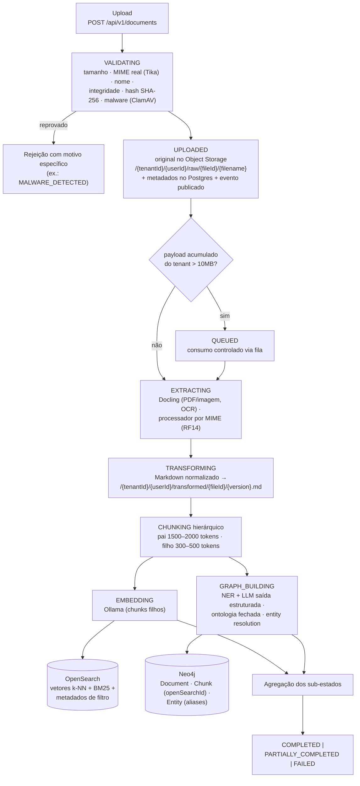
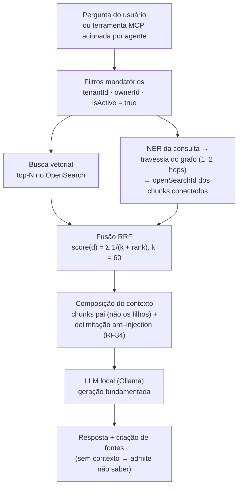

# Plano de Implementação — Plataforma GraphRAG Local (Spring Boot 4 + Spring AI)

> Plataforma de *Retrieval-Augmented Generation* com grafo de conhecimento (GraphRAG), multitenant, 100% local e gratuita — construída como estudo de uma arquitetura real: event-driven, resiliente, observável e testável.

**Status:** plano ativo, reescrito a partir dos requisitos consolidados
**Data:** Julho/2026

> **Nota de autoridade (jul/2026):** este é o documento **mais antigo** da cadeia (anterior a BDD e SDD). Use-o para a ordenação de épicos/tarefas `[N.M]`; detalhes técnicos (schemas, DoDs, contratos) vivem no SDD — em particular, `docs/sdd/dados.md` **substitui** a seção 7 deste arquivo. A execução do backlog é rastreada em `openspec/` (um change por épico).
>
> **Nota de reescrita:** este documento substitui integralmente as versões anteriores (v1–v5) do plano, que foram escritas *antes* da consolidação dos requisitos em [`requisitos.md`](requisitos.md) e da criação da suíte BDD. O backlog antigo (17 épicos, ciclo de vida `PENDING → PARSING → ... → INDEXED`, tenant único via `knowledge_base`) diverge do que o projeto é hoje e não deve mais ser usado como referência. As **ADRs continuam válidas** — são decisões de arquitetura pontuais que sobreviveram à reescrita: [ADR-001](adr/ADR-001-storage-artefatos-documento.md) (storage de artefatos), [ADR-002](adr/ADR-002-parsing-pdf-imagem-docling.md) (Docling para PDF/imagem) e [ADR-003](adr/ADR-003-embeddings-via-ollama.md) (embeddings via Ollama).

---

## Sumário

1. [Papel deste documento](#1-papel-deste-documento)
2. [Visão Geral e Premissas](#2-visão-geral-e-premissas)
3. [Arquitetura da Solução](#3-arquitetura-da-solução)
4. [Stack Tecnológico](#4-stack-tecnológico)
5. [Estado Atual do Repositório](#5-estado-atual-do-repositório)
6. [Backlog — Épicos, RFs e Features BDD](#6-backlog--épicos-rfs-e-features-bdd)
7. [Modelo de Dados (referência)](#7-modelo-de-dados-referência)
8. [Fluxo de Trabalho BDD](#8-fluxo-de-trabalho-bdd)
9. [Roadmap Sugerido](#9-roadmap-sugerido)
10. [Riscos e Pontos de Atenção](#10-riscos-e-pontos-de-atenção)
11. [Referências](#11-referências)

---

## 1. Papel deste documento

A documentação do projeto tem uma hierarquia clara — cada arquivo responde uma pergunta diferente, e este plano é a ponte entre requisitos e implementação:

| Documento                           | Pergunta que responde                       | Papel                                                                                                                                                                      |
|-------------------------------------|---------------------------------------------|----------------------------------------------------------------------------------------------------------------------------------------------------------------------------|
| [`requisitos.md`](requisitos.md)    | **O quê** o sistema deve fazer              | Fonte da verdade: RF01–RF39 + RNF01–04. Nenhum épico abaixo inventa escopo fora deles.                                                                                     |
| `rag-plan.md` (este arquivo)        | **Em que ordem e em que pedaços** construir | Backlog: agrupa os RFs em épicos, aponta os critérios de aceite (BDD) e o estado atual.                                                                                    |
| [`sdd.md`](sdd.md) + [`sdd/`](sdd/) | **Como** cada pedaço é desenhado            | Design detalhado **escrito** (índice + documentos por domínio), com C4 até C3 e o Architecture Decision Log (ADL) da sessão de descoberta.                                 |
| [`adr/`](adr/)                      | **Por que** decisões pontuais foram tomadas | Registro de decisões de arquitetura com contexto e alternativas.                                                                                                           |
| `src/test/resources/features/`      | **Quando** um requisito está pronto         | Critérios de aceite executáveis: 23 arquivos `.feature` (Gherkin pt-BR), 111 blocos de cenário (150 cenários com `Exemplos` expandidos), todos rastreados por tag `@RFxx`. |

**Regra de coerência:** se este plano disser algo diferente de `requisitos.md`, vale `requisitos.md`. Se o código/`compose.yaml` divergirem deste plano em detalhe de versão/configuração, vale o repositório — e este plano deve ser atualizado.

---

## 2. Visão Geral e Premissas

### 2.1 O que o sistema faz

Uma plataforma GraphRAG multitenant que:

1. **Ingere arquivos** (PDF, JPG/JPEG, PNG, CSV, JSON, XML, TXT, Markdown — RF04) com validação completa: tamanho, MIME real, integridade, duplicidade por hash, varredura de malware (RF01–RF07);
2. **Processa em pipeline assíncrono e rastreável** (RF08): extração com OCR (Docling), normalização para Markdown, chunking hierárquico pai/filho, e então — em paralelo (fork-join) — geração de embeddings (OpenSearch) e construção de grafo de conhecimento (Neo4j) com ontologia fechada e resolução de entidades;
3. **Responde consultas** combinando busca vetorial e travessia de grafo, fundidas por Reciprocal Rank Fusion, sempre sob filtros de tenant/dono/atividade (RF25), gerando respostas fundamentadas com citação de fontes (RF26) — inclusive via ferramentas expostas por MCP;
4. **Sobrevive a falhas**: retry, DLQ, circuit breaker, recuperação parcial por etapa, reconciliação periódica entre as bases (RF27–RF29, RF37, RF38);
5. **Isola e audita**: multitenancy estrita, log de auditoria imutável, mitigação de prompt injection, autenticação OAuth2/OIDC e conformidade com LGPD (RF30, RF31, RF34–RF36).

### 2.2 Premissas

| Premissa        | Decisão                                                                                                                                                                                                                                 |
|-----------------|-----------------------------------------------------------------------------------------------------------------------------------------------------------------------------------------------------------------------------------------|
| Custo           | **Zero.** Nenhuma dependência paga, nenhuma chave de API externa. LLM e embeddings rodam localmente (Ollama).                                                                                                                           |
| Execução        | 100% local via `compose.yaml` (fonte da verdade da infra). A execução local simula um ambiente cloud completo: upload de arquivos, eventos, bases de dados, resiliência.                                                                |
| Arquitetura     | **Monólito modular** (Spring Modulith): um JAR, fronteiras de módulo verificadas em build (`ModularityTest`), comunicação entre módulos por eventos.                                                                                    |
| Mensageria      | Eventos internos do Spring Modulith primeiro; transição para **NATS** como broker externo quando a fila real for necessária (RF12/RF13/RF39) — escolhido no lugar de Kafka por não haver necessidade dessa complexidade (ver `sdd.md`). |
| Multitenancy    | `tenantId` + `ownerId` são **estruturais desde o dia 0** — no schema relacional, nos metadados do índice vetorial e como âncora do grafo (RF30). Não é um filtro adicionado depois.                                                     |
| Identidade      | **JWT + Keycloak desde o dia 1** (realm único `graphrag`, claim `tenantId`, `ownerId` = `sub`) — não há fase de "AuthN mockada"; os valores de tenant/dono vêm sempre das claims. Decisão ADL-008 do SDD (`sdd/seguranca.md`).          |
| Qualidade       | **BDD-first**: cada RF tem cenários Gherkin executáveis; um épico só está "pronto" quando seus cenários passam sem a tag `@pendente`.                                                                                                   |
| Observabilidade | Stack LGTM já provisionada e aplicação já instrumentada (OTel), mas o **aprofundamento está postergado** (dashboards, métricas por etapa, metas de RNF) — ver `sdd.md` e Épico 10.                                                      |
| Idiomas         | O conteúdo ingerido e as consultas podem ser em **pt-BR e inglês** — o modelo de embedding precisa atender os dois (ver tarefa [5.4]).                                                                                                  |

### 2.3 Ciclo de vida do documento (RF08)

Todo documento atravessa esta máquina de estados — ela aparece em praticamente todos os épicos e é o vocabulário comum do projeto:

```
RECEIVED → VALIDATING → UPLOADED → QUEUED → EXTRACTING → TRANSFORMING → CHUNKING
                                                                            │
                                                     ┌───── fork-join ──────┤
                                                     ▼                      ▼
                                                 EMBEDDING          GRAPH_BUILDING
                                                     └──────────┬───────────┘
                                                                ▼
                                           COMPLETED | PARTIALLY_COMPLETED | FAILED
```

- `EMBEDDING` e `GRAPH_BUILDING` são **ramos paralelos e independentes** — ambos dependem só da saída de `CHUNKING`. O status geral é derivado de dois sub-estados (`embeddingStatus`, `graphStatus`).
- Se um ramo falhar definitivamente e o outro concluir, o documento fica `PARTIALLY_COMPLETED` — um documento só com embeddings ainda tem valor para a consulta (RF25); a falha do outro ramo fica disponível para reprocessamento manual.
- Cada etapa tem um status de falha próprio (`EXTRACTION_FAILED`, `TRANSFORMATION_FAILED`, `CHUNKING_FAILED`, `EMBEDDING_FAILED`, `GRAPH_BUILDING_FAILED` — RF27), e a recuperação retoma da última etapa concluída, sem reexecutar as anteriores.

---

## 3. Arquitetura da Solução

### 3.1 Pipeline de ingestão (fase offline / assíncrona)



### 3.2 Caminho de consulta (fase online / tempo real)



As duas buscas rodam **sempre em paralelo** — a fusão pondera naturalmente, sem gatilho condicional para decidir quando usar o grafo (RF25). O circuit breaker (RF37) degrada a consulta para só-vetorial quando o provedor de LLM está instável, em vez de travar a requisição.

### 3.3 Módulos (Spring Modulith)

```
com.github.overz/
├── Application.java      ← @SpringBootApplication + @Modulithic
├── api/                  ← entrada HTTP: upload, status/histórico, consulta REST
├── rag/                  ← o pipeline inteiro: extração, chunking, embeddings,
│                            grafo, retrieval híbrido, geração, GC, reconciliação
├── chat/                 ← placeholder — fora de escopo (ADL-007 do SDD)
├── mcp/                  ← servidor MCP: expõe as ferramentas de consulta a agentes
└── shared/               ← contratos cruzados: erros, logging, eventos, storage
```

| Módulo   | Responsabilidade                                                                                                                 | RFs principais                                |
|----------|----------------------------------------------------------------------------------------------------------------------------------|-----------------------------------------------|
| `api`    | Upload e validação de entrada, consulta de status/histórico, comandos (exclusão, reprocessamento, versão nova)                   | RF01–RF07, RF09, RF10 (comando)               |
| `rag`    | Pipeline de ingestão completo, ciclo de vida, retrieval híbrido + RRF, geração, GC, entity resolution, reconciliação, golden set | RF08, RF11, RF14–RF29, RF32, RF33, RF37, RF38 |
| `chat`   | **Placeholder, fora de escopo** (ADL-007) — a consulta é stateless; pontos de extensão para multi-turno em `sdd/consulta.md`     | —                                             |
| `mcp`    | Ferramentas MCP (busca híbrida, exploração de grafo) com autenticação                                                            | RF25, RF35                                    |
| `shared` | `ApplicationError`/`HttpApplicationError`, `Logger`/`LoggerFactory`, eventos de domínio, `DocumentStorage` (ADR-001)             | transversal (RF12, RF28, RF30)                |

Regras: `chat`, `rag`, `api`, `mcp` não se importam diretamente — comunicação por eventos (`ApplicationEventPublisher`) ou APIs públicas declaradas; subpacotes `internal/` são invisíveis fora do módulo; `ModularityTest` (via `ApplicationModules.verify()`) quebra o build em violação.

---

## 4. Stack Tecnológico

### 4.1 Stack e status real

| Categoria                      | Tecnologia                                                                                                                                                 | Onde está                                 | Status                                                                                  |
|--------------------------------|------------------------------------------------------------------------------------------------------------------------------------------------------------|-------------------------------------------|-----------------------------------------------------------------------------------------|
| Linguagem / Framework          | Java 25 · Spring Boot 4.1.0 · Spring Framework 7                                                                                                           | `pom.xml`                                 | ✅                                                                                       |
| Orquestração de IA             | Spring AI 2.0 (`ollama`, `vector-store-opensearch`, `mcp-server-webmvc`, `vector-store-advisor`) — `chat-memory-repository-neo4j` **sai** (ADL-007, [0.8]) | `pom.xml`                                 | ✅ dependências; nenhum uso implementado                                                 |
| Fronteiras de módulo           | Spring Modulith (core, jpa, neo4j, insight, starter-test)                                                                                                  | `pom.xml` + `ModularityTest`              | ✅                                                                                       |
| LLM local                      | Ollama 0.31.1 — chat `qwen3:8b` (tool calling) + embeddings `nomic-embed-text`, ambos residentes (`OLLAMA_MAX_LOADED_MODELS=2`, ADR-003)                   | `compose.yaml` (`ollama`, `ollama-pull`)  | ✅                                                                                       |
| Banco relacional               | PostgreSQL 18.4 (+ Adminer) — metadados, ciclo de vida, histórico, auditoria, cotas; migrado via Flyway                                                    | `compose.yaml`                            | ✅ container; schema precisa de revisão (ver [0.4])                                      |
| Vetores + full-text            | OpenSearch 3.7.0 (+ Dashboards) — k-NN e BM25 na mesma engine                                                                                              | `compose.yaml`                            | ✅ container; índice não criado                                                          |
| Grafo                          | Neo4j 5.26 Community — grafo de conhecimento + memória de chat                                                                                             | `compose.yaml`                            | ✅ container; schema não criado                                                          |
| Object Storage                 | MinIO + JuiceFS + Redis — bucket S3 montado como filesystem POSIX (ADR-001)                                                                                | `compose.yaml`                            | ✅ containers (ver fricção de credenciais na seção 5)                                    |
| Parsing PDF/imagem             | Docling Serve v1.26.0 (CPU) — layout, OCR, tabelas (ADR-002)                                                                                               | `compose.yaml` + `docling-*` no `pom.xml` | ✅                                                                                       |
| Parsing demais formatos / MIME | Apache Tika 3.3.1 (`tika-core`)                                                                                                                            | `pom.xml`                                 | ✅                                                                                       |
| Eventos / integração           | Spring Modulith events + Spring Cloud Stream + Spring Integration (http, jpa, stomp, websocket)                                                            | `pom.xml`                                 | ✅ dependências                                                                          |
| Observabilidade                | Grafana OTel-LGTM 0.28.0; app com `spring-boot-starter-opentelemetry` + appender OTLP de logs; scrape de métricas via `infra/otelcol-config.yaml`          | `compose.yaml` + `application.yaml`       | ✅ wiring; aprofundamento postergado (Épico 10)                                          |
| Testes                         | Testcontainers 2.x (postgresql, neo4j, grafana, docling), Cucumber 7.34.4 (BDD), JUnit                                                                     | `pom.xml` + `src/test`                    | ✅ (caveat Testcontainers na seção 5)                                                    |
| **Mensageria externa**         | **NATS**                                                                                                                                                   | —                                         | ⏳ **pendente** — entra no `compose.yaml` no Épico 3 ([3.4])                             |
| **Antimalware**                | **ClamAV**                                                                                                                                                 | —                                         | ⏳ **pendente** — entra no `compose.yaml` no Épico 1 ([1.3])                             |
| **NER (entidades)**            | **GLiNER** — sidecar CPU zero-shot, rótulos = ontologia do RF21 (ADL-006)                                                                                  | —                                         | ⏳ **pendente** — spike + ADR no Épico 6 ([6.1]); também usado no NER de consulta (RF25) |
| **Identidade (OAuth2/OIDC)**   | **Keycloak** (última versão; realm `graphrag` versionado em JSON, importado no start — ADL-008)                                                            | —                                         | ⏳ **decidido** — entra no `compose.yaml` no Épico 0 ([0.7]); AuthN real desde o dia 1   |
| **Resiliência de chamadas**    | Resilience4j (circuit breaker/timeout)                                                                                                                     | —                                         | ⏳ **pendente** — entra no `pom.xml` no Épico 8 ([8.4])                                  |

### 4.2 Embeddings e pt-BR

`nomic-embed-text` (768 dimensões) é a escolha atual (ADR-003) — leve e boa para retrieval, mas de foco primário em inglês. Como o projeto exige pt-BR + inglês, a tarefa [5.4] valida essa escolha **com dados** (golden set do RF33) e, se insuficiente, migra para um modelo multilíngue servido pelo mesmo Ollama (ex.: `bge-m3`) — a decisão de *provedor* (Ollama) não muda, só o modelo. Atenção: trocar o modelo de embedding muda a dimensão do vetor e **exige reindexar tudo** — por isso a validação vem antes do volume.

### 4.3 Hardware (resumo)

O `compose.yaml` já dimensiona cada serviço com `reservations`/`limits` explícitos para caber tudo junto numa máquina de desenvolvimento: Ollama é o único serviço "gordo" (8–12GB, GPU NVIDIA reservada), OpenSearch e Neo4j sobem com heap reduzido (512m/400m). No Linux, o OpenSearch exige `sudo sysctl -w vm.max_map_count=262144` antes de subir. Tudo funciona só em CPU também — mais lento, viável para estudo.

---

## 5. Estado Atual do Repositório

> **Atualização (julho/2026): Épico 1 concluído** — change `openspec/changes/epico-1-ingestao-e-validacao`. RF01–RF07 implementados: `POST /api/v1/documents` (202, `correlationId`, role `document:upload`) com cadeia de 8 validações (tamanho → nome → vazio → MIME real/Tika → integridade estrutural `CORRUPTED_FILE` → duplicidade → cota → malware), storage RAW atrás da porta `DocumentStorage` (adaptador POSIX), persistência/histórico no `rag` via `DocumentCommandApi` (dependência `api → rag`), migração `V2__tenant_quotas.sql` (cota opt-in). **ClamAV ([1.3]) foi adiado por decisão de planejamento**: a porta `MalwareScanner` existe com mock EICAR-aware — a integração `clamd` real troca só o adaptador. Reenvio pós-`FAILED` entra como `version+1` (constraint RF07 preservada). Features `ingestao/` verdes, exceto o cenário de reprocessamento explícito (`@pendente` até existir pipeline/`/reprocess`).
>
> **Atualização (julho/2026): Épico 0 concluído** — change `openspec/changes/epico-0-fundacoes` (arquivado em `archive/2026-07-13-epico-0-fundacoes`). Os débitos 1–7 listados abaixo foram todos resolvidos: wrapper regenerado, Testcontainers 2.x migrado (+ container Keycloak), portas resolvidas (app 8090; Keycloak 8080; Adminer 8081), `V1__baseline_documents.sql` conforme `sdd/dados.md` §2, credenciais unificadas em `infra/minio/.env.minio`, `max-file-size` 6MB, Keycloak 26.7.0 no compose com realm versionado e app como resource server (`CallerContext`), dependência de chat memory removida. Harness E2E/BDD ativo — os 2 cenários `@RF35` de token passam sem `@pendente`. Extras descobertos na implementação: AppArmor exigiu `security_opt` no `juicefs-mount`; postgres:18+ mudou o datadir; AWS SDK excluído do starter OpenSearch; `spring-modulith-starter-neo4j` removido (registry duplicado).

O que existe hoje, verificado no código (julho/2026):

**Pronto e funcionando**

- **Infra local completa** no `compose.yaml` (todos os serviços da seção 4.1 marcados ✅), com limites de recursos e comentários explicando cada decisão.
- **Esqueleto do monólito modular**: `Application` + módulos `api`/`chat`/`rag`/`mcp` (só `package-info.java` com `@ApplicationModule`) + `shared` com as convenções do projeto (`ApplicationError`/`HttpApplicationError`, `Logger`/`LoggerFactory`/`Slf4JLogger`). `mvn compile` passa.
- **Suíte BDD completa**: 23 features / 111 blocos de cenário (150 expandidos) / 397 steps esqueleto em 9 classes (`com.github.overz.bdd.steps`), organizadas em 9 áreas que espelham os RFs. Runner `CucumberTest` com filtro `not @pendente` — build verde com zero cenários ativos até os RFs serem implementados.
- **Instrumentação OTel** na aplicação (traces/logs via push OTLP, métricas via scrape) apontando para o LGTM.
- **ADRs 001–003** — decisões válidas (ADR-001 com adendo: estágios `RAW`/`EXTRACTED`/`TRANSFORMED`); os itens de código que elas marcavam como "Feito" foram removidos no reset (ver abaixo) e precisam ser reimplementados, mas as decisões em si não mudam.
- **SDD completo** ([`sdd.md`](sdd.md) + [`sdd/`](sdd/)): C4 até C3, contratos, modelos de dados e o Architecture Decision Log (ADL-001..010) da sessão de descoberta — tarefa [0.6] concluída.

**Importante: o código de domínio foi resetado.** A implementação anterior de upload (`DocumentController`, `DocumentStorage`, `DoclingPdfDocumentReader` etc.) foi removida para recomeçar guiado por requisitos + BDD. **Nenhum RF está implementado hoje** — o backlog da seção 6 parte do zero em código de domínio, com a infra e as convenções já resolvidas.

**Débitos e fricções conhecidos** (tratados no Épico 0):

1. `mvnw`/`mvnw.cmd` ausentes (só `.mvn/wrapper/maven-wrapper.properties` existe) — regenerar com `mvn -N wrapper:wrapper`.
2. `TestcontainersConfiguration` com os beans de Postgres/Neo4j comentados — Testcontainers 2.x tornou `PostgreSQLContainer`/`Neo4jContainer` non-generic e quebrou o padrão antigo; migrar para a API nova.
3. **Conflito de porta 3000**: a app usa `APP_PORT:3000` por padrão e o `grafana-lgtm` publica `3000:3000` — não sobem juntos.
4. **Migração `V1__create_documents_table.sql` segue o plano antigo** (`knowledge_base`, status `PENDING`, sem `tenant_id`/`owner_id`, sem sub-estados de fork-join) — substituir pelo schema da seção 7 antes de qualquer implementação de RF01.
5. **Credenciais divergentes no JuiceFS**: `juicefs-format` usa `ragadmin`/`ragadmin123`, mas o MinIO sobe com `miniouser`/`miniopass` — o format falha autenticação; alinhar no `compose.yaml`.
6. `application.yaml` com `max-file-size: 20MB` — divergente do limite de 5MB por arquivo do RF03 (a validação de negócio é da aplicação, mas o valor precisa ser coerente — o SDD fixa "um pouco acima de 5MB", ver `sdd/ingestao.md` §2).
7. `spring-ai-starter-model-chat-memory-repository-neo4j` no `pom.xml` sem uso previsto — a consulta é stateless (ADL-007); remover ([0.8]).

---

## 6. Backlog — Épicos, RFs e Features BDD

### Como usar

- Cada **épico** agrupa RFs correlatos e é dono de uma área da suíte BDD — a rastreabilidade é tripla: `épico ↔ RFxx ↔ arquivo.feature`.
- Cada **tarefa** `[N.M]` é um item de backlog atômico. **Esforço:** `P` (horas) · `M` (meio a 1 dia) · `G` (vários dias). **Prioridade (MoSCoW):** `Must`/`Should`/`Could`/`Backlog`.
- **DoD padrão de toda tarefa que implementa RF:** os cenários `@RFxx` correspondentes passam com a tag `@pendente` removida (ver seção 8). O DoD explícito abaixo só aparece quando há algo além disso.

| #  | Épico                          | RFs                            | Features BDD         | Prioridade           |
|----|--------------------------------|--------------------------------|----------------------|----------------------|
| 0  | Fundação e débitos de ambiente | —                              | —                    | Must                 |
| 1  | Ingestão e Validação           | RF01–RF07                      | `ingestao/`          | Must                 |
| 2  | Ciclo de Vida do Documento     | RF08–RF11                      | `ciclo-de-vida/`     | Must                 |
| 3  | Eventos, Fila e Carga          | RF12, RF13, RF39               | `processamento/`     | Must                 |
| 4  | Extração e Transformação       | RF14–RF17                      | `extracao/`          | Must                 |
| 5  | Pipeline Vetorial              | RF18–RF20 (+RF33 p/ validação) | `pipeline-vetorial/` | Must                 |
| 6  | Knowledge Graph                | RF21–RF24, RF32                | `knowledge-graph/`   | Must                 |
| 7  | Consulta GraphRAG e MCP        | RF25, RF26, RF33               | `consulta/`          | Must                 |
| 8  | Resiliência                    | RF27–RF29, RF37, RF38          | `resiliencia/`       | Must/Should          |
| 9  | Segurança e Conformidade       | RF30, RF31, RF34–RF36          | `seguranca/`         | Must (RF30) / Should |
| 10 | Observabilidade e RNFs         | RF28 (métricas), RNF01–04      | —                    | Postergado           |

---

### Épico 0 — Fundação e Débitos de Ambiente

> Deixar o repositório sem fricção antes do primeiro RF: build reprodutível, dev-mode funcionando, schema alinhado aos requisitos.

**[0.1] Regenerar o wrapper Maven** `[P · Must]`
`mvn -N wrapper:wrapper` e commitar `mvnw`/`mvnw.cmd`.
✅ **DoD:** `./mvnw clean compile` funciona numa máquina sem Maven global.

**[0.2] Migrar `TestcontainersConfiguration` para a API do Testcontainers 2.x** `[M · Must]`
Reativar os beans de Postgres e Neo4j (hoje comentados) com o padrão novo (containers non-generic).
✅ **DoD:** `./mvnw spring-boot:test-run` sobe a app com Postgres/Neo4j reais, sem Docker Compose.

**[0.3] Resolver o conflito de porta 3000 (app × Grafana)** `[P · Must]`
Escolher: mudar o default de `APP_PORT` ou remapear a porta publicada do `grafana-lgtm`.
✅ **DoD:** `docker compose up` + `./mvnw spring-boot:run` sobem juntos sem conflito.

**[0.4] Reescrever a migração Flyway com o schema dos requisitos** `[M · Must]`
Substituir a `V1` atual (modelo do plano antigo) pelo schema da seção 7: `tenant_id`/`owner_id`, ciclo de vida do RF08 com sub-estados, histórico, auditoria, erros estruturados. Como nenhum ambiente tem dado real, é reescrita da `V1`, não migração incremental.
✅ **DoD:** Flyway aplica o schema num banco limpo; colunas cobrem RF06, RF08 e RF09.

**[0.5] Corrigir as fricções do `compose.yaml`/`application.yaml`** `[P · Must]`
Credenciais do JuiceFS×MinIO alinhadas (fricção 5 da seção 5); `max-file-size` coerente com o RF03.
✅ **DoD:** `juicefs-format` executa com sucesso; mount em `./tmp/blobstore` gravável pela app.

**[0.6] Escrever o SDD com C4 até C3** `[G · Must]` — ✅ **concluído (julho/2026)**
Entregue como `sdd.md` (índice + Architecture Decision Log ADL-001..010) + `docs/sdd/` por domínio: C4 até C3, contratos, modelos de dados e as decisões fechadas em sessão de descoberta (NER via GLiNER, identidade via Keycloak, consulta stateless síncrona, formato físico do SDD).

**[0.7] Keycloak no `compose.yaml` + app como resource server** `[M · Must]`
Padrão da ADL-008: build otimizado (`kc.sh build --db=postgres --health-enabled --metrics-enabled`), `.env.keycloak`, realm `graphrag` versionado em JSON (2 tenants × 2 usuários de teste + roles granulares por operação) importado no start; app com Spring Security OAuth2 Resource Server e `CallerContext` resolvido das claims. Detalhe em `sdd/seguranca.md` §1.
✅ **DoD:** upload/status só funcionam com JWT válido do realm; token sem claim `tenantId` é rejeitado com `401`.

**[0.8] Remover a dependência de chat memory do `pom.xml`** `[P · Must]`
`spring-ai-starter-model-chat-memory-repository-neo4j` sai (ADL-007 — consulta stateless; multi-turno é ponto de extensão sem RF).
✅ **DoD:** build verde sem a dependência; módulo `chat` segue como placeholder.

---

### Épico 1 — Ingestão e Validação (RF01–RF07)

> *Features:* `ingestao/upload.feature`, `ingestao/validacao.feature`
> *User story:* como usuário de um tenant, quero enviar arquivos com validação e deduplicação confiáveis, para que só conteúdo íntegro e inédito entre no pipeline.

**[1.1] Endpoint de upload** `[M · Must]` — `POST /api/v1/documents` (multipart), respondendo `202` com id + status; gera `correlationId` no ato do upload (RF01, RF28). Estados `RECEIVED → VALIDATING`.

**[1.2] Cadeia de validações** `[M · Must]` — tamanho máximo 5MB, extensão × MIME real (Tika, não extensão), nome de arquivo (inclusive path traversal), arquivo vazio/corrompido, duplicidade (RF02, RF04). Rejeição sempre informa o motivo; formatos aceitos: PDF, JPG, JPEG, PNG, CSV, JSON, XML, TXT, MD (DOCX/XLSX/PPTX ficam registrados como avaliação futura — RF04 complemento).

**[1.3] Varredura antimalware** `[M · Must]` — integrar ClamAV (novo serviço no `compose.yaml`) antes do status `UPLOADED`; falha gera rejeição `MALWARE_DETECTED` sem consumir cota de reprocessamento (RF02 complemento).
> **Nota (jul/2026, change epico-1):** adiado por decisão de planejamento. A porta `MalwareScanner` e a validação já existem (mock determinístico EICAR-aware, cenários BDD de malware verdes); esta tarefa passa a ser apenas o serviço ClamAV no `compose.yaml` + o adaptador `clamd`.

**[1.4] Idempotência por hash** `[P · Must]` — SHA-256 no upload; mesmo hash com sucesso anterior no mesmo tenant/usuário rejeita, salvo comando explícito de reprocessamento; hash igual de *outro* usuário não bloqueia (RF07).

**[1.5] Armazenamento do original** `[M · Must]` — `DocumentStorage` (reimplementar conforme ADR-001) gravando em `/{tenantId}/{userId}/raw/{fileId}/{filename}` (RF05); a chave retornada vai para o Postgres, nunca caminho cru.

**[1.6] Metadados e cotas** `[M · Must]` — linha em `documents` com todos os campos do RF06; cota por tenant (armazenamento/arquivos ativos) e teto de payload acumulado de 10MB que desvia para `QUEUED` (RF03 — o consumo controlado em si é do Épico 3).

---

### Épico 2 — Ciclo de Vida do Documento (RF08–RF11)

> *Features:* `ciclo-de-vida/status-e-historico.feature`, `ciclo-de-vida/soft-delete-e-versionamento.feature`, `ciclo-de-vida/garbage-collection.feature`
> *User story:* como usuário, quero acompanhar cada documento do recebimento à conclusão — e excluir/substituir sem corromper o que outros documentos compartilham.

**[2.1] Máquina de estados com fork-join** `[G · Must]` — implementar o ciclo do RF08 com sub-estados `embeddingStatus`/`graphStatus` e derivação `COMPLETED`/`PARTIALLY_COMPLETED`/`FAILED`. É a espinha dorsal que os épicos 3–6 preenchem.

**[2.2] Status e histórico** `[M · Must]` — consulta de status atual e histórico completo de transições por arquivo (RF09); documento inexistente responde not-found limpo.

**[2.3] Soft delete com isolamento de grafo** `[M · Must]` — exclusão marca `isActive=false` no `Document` e `Chunks` (Neo4j) e inativa os vetores (OpenSearch); entidades/relacionamentos referenciados por outros documentos ativos permanecem intactos (RF10). Exclusão de documento alheio é negada (RF30).

**[2.4] Substituição de versão** `[M · Should]` — nova versão reprocessa o pipeline completo; a anterior segue o fluxo de soft delete; diffing incremental fica como otimização futura (RF10 complemento).

**[2.5] Garbage collection de órfãos** `[M · Should]` — job em background remove fisicamente entidades/relacionamentos sem conexão com nenhum chunk ativo (RF11); entidade com ao menos um chunk ativo é preservada.

---

### Épico 3 — Eventos, Fila e Carga (RF12, RF13, RF39)

> *Feature:* `processamento/eventos-e-fila.feature`
> *User story:* como sistema, quero processar de forma assíncrona, idempotente e justa entre tenants, sem que um pico derrube a aplicação.

**[3.1] Eventos internos (Modulith)** `[M · Must]` — após a persistência inicial, publicar eventos de domínio via `ApplicationEventPublisher` com o *event publication registry* do Modulith (entrega at-least-once, reemissão de eventos incompletos); `correlationId` propagado em todos (RF12, RF28).

**[3.2] Consumo idempotente e isolado** `[M · Must]` — consumir o mesmo evento duas vezes não duplica efeito; falha no processamento de um documento não afeta os demais (RF13).

**[3.3] Controle de carga (QUEUED)** `[M · Must]` — payload acumulado acima de 10MB entra em `QUEUED` e a extração é delegada estritamente ao consumo assíncrono controlado, evitando OOM (RF03/RF13).

**[3.4] NATS como broker externo** `[G · Should]` — adicionar NATS ao `compose.yaml` e mover os eventos do pipeline para ele quando os limites dos eventos internos aparecerem (design do RF12 já prevê a transição). Validar a integração Java (cliente `nats-spring`/binder) e registrar em ADR própria.

**[3.5] Fair queueing por tenant** `[M · Should]` — limite de concorrência por tenant no listener (mitigação imediata do "noisy neighbor"); particionamento pleno por tenant vem com o NATS (RF39).

---

### Épico 4 — Extração e Transformação (RF14–RF17)

> *Feature:* `extracao/extracao-e-transformacao.feature`
> *User story:* como pipeline, quero converter qualquer formato aceito em Markdown padronizado, com OCR quando não houver camada de texto.

**[4.1] Delegação por MIME** `[M · Must]` — factory de processadores segregados por tipo (RF14): PDF/imagem → Docling (`DoclingPdfDocumentReader`, reimplementar conforme ADR-002); MD/TXT/CSV/JSON/XML → leitores dedicados (Tika como apoio universal e detector de MIME).

**[4.2] Extração nativa + OCR** `[M · Must]` — texto nativo quando existe; OCR integrado (docling-serve) para JPG/PNG e PDFs escaneados (RF15).

**[4.3] Normalização para Markdown** `[M · Must]` — todo conteúdo extraído converge para Markdown padronizado (RF16), preservando estrutura (títulos, tabelas).

**[4.4] Armazenamento do transformado** `[P · Must]` — gravar em `/{tenantId}/{userId}/transformed/{fileId}/{version}.md` via `DocumentStorage` e atualizar status (RF17).

---

### Épico 5 — Pipeline Vetorial (RF18–RF20)

> *Features:* `pipeline-vetorial/chunking.feature`, `pipeline-vetorial/embeddings.feature`
> *User story:* como sistema de busca, quero chunks hierárquicos — filhos precisos para embedding, pais amplos para contexto — indexados com os metadados que garantem isolamento.

**[5.1] Chunking hierárquico** `[G · Must]` — chunk pai (seção, 1500–2000 tokens, contexto para a LLM no RF26) e chunk filho (300–500 tokens, unidade de embedding/indexação); relação pai-filho persistida; cada chunk com identificador, conteúdo, posição e documento de origem; CSV/JSON sem estrutura semântica usam tamanho fixo com overlap de 10–15% (RF18).

**[5.2] Geração de embeddings** `[M · Must]` — evento dispara a chamada ao modelo de embedding via Ollama (ADR-003) para os chunks filhos (RF19).

**[5.3] Armazenamento vetorial com metadados de filtro** `[M · Must]` — índice OpenSearch com `chunkId`, `documentId`, `ownerId`, `tenantId`, `isActive` mapeados como `keyword` (RF20); **toda** leitura do índice aplica os filtros — auditar que não existe query sem eles.

**[5.4] Validação do embedding em pt-BR/inglês** `[M · Must]` — medir `nomic-embed-text` contra o golden set (RF33) em consultas nos dois idiomas; se insuficiente, migrar para modelo multilíngue via Ollama (ex.: `bge-m3`) e registrar em ADR (troca exige reindexação — seção 4.2).

---

### Épico 6 — Knowledge Graph (RF21–RF24, RF32)

> *Features:* `knowledge-graph/extracao-entidades.feature`, `knowledge-graph/construcao-grafo.feature`, `knowledge-graph/entity-resolution.feature`
> *User story:* como plataforma GraphRAG, quero um grafo de entidades limpo — ontologia fechada, sem duplicatas, sempre ancorado ao tenant — para responder o que a similaridade sozinha não alcança.

**[6.1] Extração híbrida com ontologia fechada** `[G · Must]` — NER rápido via **GLiNER** (sidecar CPU zero-shot, rótulos = a própria ontologia; spike + ADR no início do épico — ADL-006, fallback: extração só-LLM) para entidades triviais + LLM com *structured output* para relacionamentos complexos, restritos a schema fechado: entidades `PERSON`, `ORGANIZATION`, `PRODUCT`, `TECHNOLOGY`, `LOCATION`, `DATE`, `CONCEPT`; relacionamentos `USES`, `DEPENDS_ON`, `PART_OF`, `AUTHORED_BY`, `MENTIONS` + escape `RELATED_TO` com propriedade descritiva. Resposta fora do schema é descartada sem interromper o pipeline; o schema é **versionado**, com estratégia de migração para mudanças (RF21).

**[6.2] Construção do grafo** `[M · Must]` — nós `Document`, `Chunk`, `Entity` e relacionamentos no Neo4j (RF22), sempre ancorados ao tenant.

**[6.3] `openSearchId` obrigatório** `[P · Must]` — todo nó `Chunk` carrega o `openSearchId` do vetor correspondente; escrita sem ele é rejeitada (RF23) — é a ponte vetor↔grafo que o retrieval (RF25) e a reconciliação (RF38) usam.

**[6.4] Entity resolution** `[G · Must]` — antes de persistir `Entity` nova: (1) match determinístico por nome normalizado + tipo no tenant; (2) similaridade de embedding do nome+contexto com merge automático acima do limiar de confiança, fila de revisão manual na faixa intermediária, nó novo abaixo dela; aliases preservados no nó mesclado; **nunca** mescla entre tenants distintos (RF32).

**[6.5] Escopo global × local** `[M · Should]` — agrupamentos/comunidades orientados por `tenantId`; consultas restritas validam `ownerId` (RF24).

---

### Épico 7 — Consulta GraphRAG e MCP (RF25, RF26, RF33)

> *Features:* `consulta/recuperacao-hibrida.feature`, `consulta/geracao-resposta.feature`
> *User story:* como usuário (ou agente via MCP), quero respostas fundamentadas que combinem semântica e topologia, com fontes citadas — e quero que o sistema admita quando não sabe.

**[7.1] Retrieval híbrido paralelo** `[G · Must]` — busca vetorial top-N e, em paralelo, NER da consulta + travessia do grafo limitada a 1–2 hops a partir das entidades identificadas, resgatando os `openSearchId` dos chunks conectados (RF25).

**[7.2] Fusão RRF + filtros mandatórios** `[M · Must]` — Reciprocal Rank Fusion com `k = 60` como partida; filtros `ownerId`/`tenantId`/`isActive=true` aplicados em **todas** as buscas, sem exceção (RF25).

**[7.3] Ferramentas MCP** `[M · Must]` — expor a recuperação híbrida e a exploração de grafo como tools MCP (`spring-ai-starter-mcp-server-webmvc`), retornando contexto unificado (topologia + texto) para agentes externos (RF25).

**[7.4] Geração fundamentada** `[M · Must]` — prompt composto com os **chunks pai** dos filhos recuperados; resposta cita as fontes; sem contexto suficiente, o sistema admite não saber em vez de alucinar; conteúdo de documento sempre delimitado como dado, não instrução (RF26, RF34).

**[7.5] Golden set e avaliação** `[M · Must]` — conjunto de consultas de referência com chunks/entidades esperados, medindo precisão/recall e comparando GraphRAG (grafo+vetor) contra retrieval puramente vetorial (RF33) — é o que valida a arquitetura com dados e alimenta a [5.4].

---

### Épico 8 — Resiliência (RF27–RF29, RF37, RF38)

> *Features:* `resiliencia/falha-e-recuperacao.feature`, `resiliencia/retry-dlq.feature`, `resiliencia/circuit-breaker.feature`, `resiliencia/reconciliacao.feature`
> *User story:* como operador, quero que falhas sejam isoladas por etapa, recuperáveis do ponto onde pararam, e que as bases nunca divirjam silenciosamente.

**[8.1] Falha isolada por etapa + recuperação parcial** `[G · Must]` — cada fase com status de falha próprio (`EXTRACTION_FAILED`, ..., `GRAPH_BUILDING_FAILED`); reprocessamento retoma da última etapa concluída, aproveitando artefatos já persistidos (chunks salvos, etc.) (RF27).

**[8.2] Registro estruturado de erros + rastreabilidade** `[M · Must]` — todo erro registra etapa, código, mensagem, timestamp, tentativa e payload de diagnóstico (RF28); `correlationId` do upload presente em todos os eventos e logs de todas as etapas (a instrumentação OTel já existente carrega o trace).

**[8.3] Retry + DLQ** `[M · Must]` — falhas transitórias (ex.: rate limit) com retentativas automáticas e backoff; falhas definitivas roteadas para DLQ com status `FAILED` e reprocessamento manual restrito a usuários autorizados (RF29).

**[8.4] Circuit breaker nas chamadas de IA** `[M · Should]` — Resilience4j em torno de LLM/embedding (RF19, RF21, RF26): circuito aberto → fallback por etapa — embedding reenfileira para depois; consulta degrada para resposta só-vetorial em vez de travar (RF37). Distinto do retry: trata degradação sustentada, não falha pontual.

**[8.5] Reconciliação Neo4j ↔ OpenSearch** `[M · Should]` — job periódico verifica que todo `Chunk` ativo tem vetor correspondente e vice-versa; vetor órfão é removido, chunk sem vetor é sinalizado para reindexação, divergências registradas para auditoria; avaliar padrão outbox como mitigação preventiva (RF38).

---

### Épico 9 — Segurança e Conformidade (RF30, RF31, RF34–RF36)

> *Features:* `seguranca/multitenant.feature`, `seguranca/auditoria.feature`, `seguranca/prompt-injection.feature`, `seguranca/autenticacao-e-criptografia.feature`, `seguranca/lgpd.feature`
> *User story:* como responsável pela plataforma, quero isolamento absoluto entre tenants, trilha de auditoria imutável e conformidade legal — sem que conteúdo malicioso em documentos manipule a IA.

**[9.1] Isolamento multitenant (AuthZ)** `[G · Must]` — validação estrita de `userId`/`tenantId` em upload, consulta, exclusão e reprocessamento (RF30). **Nota de sequência:** o isolamento de *dados* (filtros/modelo) nasce nos épicos 1–7; esta tarefa consolida a camada de autorização em cima — não deixe para cá o que é estrutural lá.

**[9.2] Auditoria imutável** `[M · Should]` — log imutável de toda ação de estado (envios, deleções lógicas, reprocessamentos, mudanças críticas); tentativa de adulteração é rejeitada e registrada (RF31).

**[9.3] Prompt injection** `[M · Should]` — conteúdo de documento sempre delimitado como dado nos prompts (RF21, RF26); saída da extração validada contra o schema fechado; chunks com padrão suspeito são sinalizados para revisão sem bloquear o pipeline (RF34 — sinalização, não prevenção absoluta; ref. OWASP LLM01).

**[9.4] Endurecer AuthN/AuthZ e formalizar a ADR do Keycloak** `[M · Should]` — a base JWT+Keycloak nasce no Épico 0 ([0.7], ADL-008); aqui entram: a ADR formal da decisão, a cobertura completa dos cenários de `autenticacao-e-criptografia.feature` (MCP via client credentials, expiração de token, roles em todas as rotas admin) e TLS na borda via proxy (RF35). **Proposto (`openspec/changes/auth-phantom-token`, ainda não implementado):** login de usuário final passa a emitir um token opaco (Phantom Token pattern, Redis) em vez do JWT cru do Keycloak, via novo pacote `api/internal/auth/`; detalhe e decisões em aberto no `design.md` do change.

**[9.5] Criptografia** `[M · Could]` — TLS em trânsito e criptografia em repouso para Object Storage, PostgreSQL, Neo4j e OpenSearch (RF35); no escopo local, documentar o que é real e o que é simulado.

**[9.6] LGPD — direito ao esquecimento** `[G · Could]` — localizar todos os nós/relacionamentos/chunks/vetores de um titular (`PERSON`), executar hard delete **síncrono e verificável** (independente do GC do RF11) e registrar na auditoria do RF31 (RF36).

---

### Épico 10 — Observabilidade e RNFs `[postergado]`

Conforme `sdd.md`, o aprofundamento de monitoração fica **postergado** — o que já existe permanece (LGTM no compose, OTel wiring na app, traces/logs/métricas fluindo) e é suficiente para desenvolver. Quando este épico for ativado:

- Métricas por etapa do pipeline: latência, profundidade de fila, taxa de retry, volume em DLQ (RF28 complemento) e dashboards correspondentes.
- Metas dos RNFs definidas antes de teste de carga: RNF01 (p95 < 3s na recuperação, ponto de partida), RNF02 (throughput de ingestão sem degradar consulta), RNF03 (backup/RPO/RTO de Neo4j e OpenSearch — bases não reconstruíveis sem reprocessar tudo), RNF04 (disponibilidade de consulta vs. ingestão).

---

## 7. Modelo de Dados (referência)

> Esboço de referência para alinhar os épicos — o detalhamento final (tipos exatos, índices, constraints) é do `sdd.md`. Substitui o schema do plano antigo (que usava `knowledge_base` e o ciclo de vida pré-RF08).

### 7.1 PostgreSQL — controle, histórico e auditoria

```sql
CREATE TABLE documents
(
  id                      UUID PRIMARY KEY      DEFAULT gen_random_uuid(),
  tenant_id               VARCHAR(100) NOT NULL,                    -- RF05/RF06/RF30
  owner_id                VARCHAR(100) NOT NULL,
  filename                VARCHAR(255) NOT NULL,
  extension               VARCHAR(20),
  content_type            VARCHAR(100),
  file_size_bytes         BIGINT,
  file_hash_sha256        VARCHAR(64)  NOT NULL,
  raw_storage_key         VARCHAR(500),                             -- ADR-001: referência, nunca conteúdo
  transformed_storage_key VARCHAR(500),
  status                  VARCHAR(30)  NOT NULL DEFAULT 'RECEIVED', -- ciclo RF08
  embedding_status        VARCHAR(30),                              -- sub-estado do fork-join
  graph_status            VARCHAR(30),                              -- sub-estado do fork-join
  error_message           TEXT,
  version                 INT          NOT NULL DEFAULT 1,          -- RF10 complemento
  is_active               BOOLEAN      NOT NULL DEFAULT TRUE,       -- soft delete RF10
  correlation_id          VARCHAR(100) NOT NULL,                    -- RF28 complemento
  uploaded_at             TIMESTAMP    NOT NULL DEFAULT now(),
  processed_at            TIMESTAMP,
  UNIQUE (tenant_id, owner_id, file_hash_sha256, version)           -- idempotência RF07
);

CREATE TABLE document_status_history
( -- RF09
  id          BIGSERIAL PRIMARY KEY,
  document_id UUID        NOT NULL REFERENCES documents (id),
  from_status VARCHAR(30),
  to_status   VARCHAR(30) NOT NULL,
  occurred_at TIMESTAMP   NOT NULL DEFAULT now(),
  detail      TEXT
);

CREATE TABLE processing_errors
( -- RF28
  id             BIGSERIAL PRIMARY KEY,
  document_id    UUID         NOT NULL REFERENCES documents (id),
  stage          VARCHAR(30)  NOT NULL,
  error_code     VARCHAR(50)  NOT NULL,
  message        TEXT,
  attempt        INT          NOT NULL,
  diagnostic     JSONB,
  correlation_id VARCHAR(100) NOT NULL,
  occurred_at    TIMESTAMP    NOT NULL DEFAULT now()
);

-- audit_log (RF31): append-only, sem UPDATE/DELETE — imutabilidade garantida
-- por permissão/trigger; desenho exato no sdd.md.
```

Cotas por tenant (RF03) e a fila de revisão de entity resolution (RF32) ganham tabelas próprias quando os épicos 1 e 6 chegarem.

### 7.2 OpenSearch — índice de chunks (filhos)

```json
{
  "settings": {
    "index": {
      "knn": true
    }
  },
  "mappings": {
    "properties": {
      "content": {
        "type": "text"
      },
      "embedding": {
        "type": "knn_vector",
        "dimension": 768
      },
      "chunkId": {
        "type": "keyword"
      },
      "documentId": {
        "type": "keyword"
      },
      "ownerId": {
        "type": "keyword"
      },
      "tenantId": {
        "type": "keyword"
      },
      "isActive": {
        "type": "boolean"
      },
      "parentChunkId": {
        "type": "keyword"
      }
    }
  }
}
```

Os metadados de filtro do RF20 são `keyword` (não `text`) — senão o filtro exato vira busca textual e vaza silenciosamente. `dimension: 768` segue o `nomic-embed-text`; muda se a [5.4] trocar o modelo.

### 7.3 Neo4j — grafo de conhecimento

```cypher
CREATE CONSTRAINT document_id IF NOT EXISTS FOR (d:Document) REQUIRE d.id IS UNIQUE;
CREATE CONSTRAINT chunk_id    IF NOT EXISTS FOR (c:Chunk)    REQUIRE c.id IS UNIQUE;
CREATE CONSTRAINT entity_canonical IF NOT EXISTS
  FOR (e:Entity) REQUIRE (e.tenantId, e.canonicalName, e.type) IS UNIQUE;

// Nós
// (:Document {id, tenantId, ownerId, version, isActive})
// (:Chunk    {id, tenantId, openSearchId, isActive})       -- openSearchId OBRIGATÓRIO (RF23)
// (:Entity   {id, tenantId, name, canonicalName, type, aliases, schemaVersion})

// Estrutura
// (:Document)-[:HAS_CHUNK]->(:Chunk)
// (:Chunk)-[:CHILD_OF]->(:Chunk)                            -- hierarquia pai/filho (RF18)
// (:Chunk)-[:MENTIONS]->(:Entity)

// Conhecimento — ontologia fechada (RF21), versionada
// (:Entity)-[:USES|DEPENDS_ON|PART_OF|AUTHORED_BY|MENTIONS]->(:Entity)
// (:Entity)-[:RELATED_TO {description}]->(:Entity)          -- escape para fora do schema
```

Todo nó carrega `tenantId` e toda query (leitura ou escrita) é ancorada por ele (RF24/RF30/RF32) — o isolamento é do modelo, não da disciplina de lembrar um `WHERE`.

---

## 8. Fluxo de Trabalho BDD

A suíte em `src/test/resources/features/` é o critério de aceite executável do backlog. Estado atual: **todas as features com `@pendente`**, e o runner (`com.github.overz.bdd.CucumberTest`) filtra `not @pendente` — o build fica verde com zero cenários ativos.

Como um RF "fecha":

1. Implementar o RF no módulo correspondente (seção 3.3).
2. Substituir o `throw new PendingException()` das steps envolvidas (`com.github.overz.bdd.steps`) pela automação real. Quando as steps precisarem do contexto Spring (MockMvc, Testcontainers), adicionar a classe `@CucumberContextConfiguration` + `@SpringBootTest` no pacote `com.github.overz.bdd` — o `cucumber-spring` já está no classpath.
3. Remover a tag `@pendente` do cenário (ou da feature inteira, quando toda ela passar).
4. `./mvnw test` — o cenário agora executa e precisa passar; `ModularityTest` continua garantindo as fronteiras.

Rastreabilidade: cada cenário carrega `@RFxx`; para ver a cobertura de um RF, `grep -rl '@RF25' src/test/resources/features/`.

---

## 9. Roadmap Sugerido

Cada fase agrupa épicos que fazem sentido juntos — ritmo de estudo, não sprint corporativa:

| Fase                        | Foco                                                                      | Épicos                      |
|-----------------------------|---------------------------------------------------------------------------|-----------------------------|
| **1 — Fundação**            | Débitos zerados, schema correto, Keycloak no ar (SDD ✅ já escrito)        | 0                           |
| **2 — Entrada confiável**   | Upload validado, deduplicado, armazenado; ciclo de vida e eventos rodando | 1, 2 (2.1–2.2), 3 (3.1–3.3) |
| **3 — Documento → vetor**   | Extração/OCR, Markdown, chunking hierárquico, embeddings indexados        | 4, 5                        |
| **4 — Primeira resposta**   | Consulta vetorial + geração fundamentada com fontes (ainda sem grafo)     | 7 (7.1 parcial, 7.2, 7.4)   |
| **5 — GraphRAG de verdade** | Grafo, entity resolution, travessia + RRF, MCP, golden set                | 6, 7 (completo)             |
| **6 — Vida real**           | Soft delete/versão/GC, resiliência completa, fair queueing, NATS          | 2 (2.3–2.5), 3 (3.4–3.5), 8 |
| **7 — Fortaleza**           | Endurecimento: ADR/TLS/criptografia, auditoria, LGPD, prompt injection    | 9                           |
| **futuro**                  | Observabilidade aprofundada e metas de RNF                                | 10                          |

**MVP (primeira resposta útil):** fim da fase 4 — pergunta respondida com base em documento real, com fontes. Isso é *deliberadamente* um GraphRAG incompleto: o próprio RF08 admite documentos `PARTIALLY_COMPLETED` (vetor sem grafo) como estado válido e útil, então o ramo `GRAPH_BUILDING` pode nascer stub e o sistema já entrega valor. O grafo (fase 5) multiplica o que existe — e o golden set (RF33) mede objetivamente esse ganho, em vez de assumi-lo.

**Não deixar para depois:** `tenantId`/`ownerId`/`isActive` em todo filtro e todo modelo desde a fase 2 — retrofit de multitenancy é o erro mais caro deste tipo de sistema. Com a ADL-008, a identidade já é real desde a fase 1 (JWT/Keycloak, [0.7]): tenant e dono vêm sempre das claims, nunca de mock.

---

## 10. Riscos e Pontos de Atenção

| Risco                                                                       | Impacto                     | Mitigação                                                                                                                                |
|-----------------------------------------------------------------------------|-----------------------------|------------------------------------------------------------------------------------------------------------------------------------------|
| Hardware local apertado (Ollama + OpenSearch + Neo4j + Docling simultâneos) | Alto                        | Limites por serviço já dimensionados no `compose.yaml`; heap reduzido nas JVMs; modelos quantizados; CPU-only funciona, só mais lento.   |
| `nomic-embed-text` insuficiente em pt-BR                                    | Alto (silencioso)           | [5.4] mede com golden set antes do volume; troca de modelo exige reindexação — decidir cedo.                                             |
| Grafo fragmentado sem entity resolution                                     | Alto (silencioso)           | [6.4] é Must, não polimento: travessia multi-hop não acha caminho se o meio está duplicado em dois nós.                                  |
| Spring AI 2.0 GA recente (poucas semanas)                                   | Médio                       | Validar contra a documentação oficial antes de copiar exemplos antigos; APIs de tool calling mudaram da 1.x para a 2.0.                  |
| Integração NATS + Spring pouco batida (binder/cliente)                      | Médio                       | [3.4] começa com spike + ADR; os eventos internos do Modulith seguram o pipeline até lá.                                                 |
| Escritas duplas (OpenSearch + Neo4j) divergirem                             | Médio                       | Reconciliação periódica ([8.5]) + `openSearchId` obrigatório ([6.3]) + avaliar outbox.                                                   |
| `vm.max_map_count` no Linux derruba o OpenSearch na subida                  | Baixo (mas rouba uma tarde) | `sudo sysctl -w vm.max_map_count=262144` antes do compose (documentado no próprio `compose.yaml`).                                       |
| Filtro de tenant esquecido em query nova                                    | Alto (vazamento)            | Isolamento estrutural (âncora no modelo, seção 7.3) + cenários BDD de `seguranca/multitenant.feature` + auditoria de queries na revisão. |
| Escopo inflar além dos RFs                                                  | Médio                       | Regra da seção 1: sem RF, não entra em épico — ideias vão para "melhorias futuras" (abaixo).                                             |
| Keycloak como dependência dura de toda a suíte BDD (token por cenário)      | Médio                       | Realm de teste mínimo versionado (o mesmo do compose) + cache de token por usuário na execução — ver `sdd/qualidade-e-testes.md`.        |

**Melhorias futuras (sem RF — não são backlog):** sanitização/mascaramento de PII pré-indexação, curadoria manual assistida por IA (auto-tagging), interface web de chat, re-ranking com cross-encoder, RAPTOR, cache semântico de respostas, suporte a DOCX/XLSX/PPTX (este último citado como avaliação no RF04). Se algum se provar necessário, primeiro vira RF em `requisitos.md`, depois entra aqui.

---

## 11. Referências

- Requisitos do projeto: [`requisitos.md`](requisitos.md) · SDD: [`sdd.md`](sdd.md) + [`sdd/`](sdd/)
- ADRs: [ADR-001 — Storage de artefatos](adr/ADR-001-storage-artefatos-documento.md) · [ADR-002 — Docling para PDF/imagem](adr/ADR-002-parsing-pdf-imagem-docling.md) · [ADR-003 — Embeddings via Ollama](adr/ADR-003-embeddings-via-ollama.md)
- Spring AI: https://docs.spring.io/spring-ai/reference/ · Spring Boot: https://docs.spring.io/spring-boot/ · Spring Modulith: https://docs.spring.io/spring-modulith/reference/
- Ollama (modelos e tool calling): https://ollama.com/library · https://docs.ollama.com/capabilities/tool-calling
- OpenSearch: https://opensearch.org/docs/latest/ · Neo4j: https://neo4j.com/docs/ · NATS: https://docs.nats.io/
- MinIO: https://min.io/docs/ · JuiceFS: https://juicefs.com/docs/community/introduction/
- Docling Serve: https://github.com/docling-project/docling-serve · Docling Java: https://github.com/docling-project/docling-java
- ClamAV: https://docs.clamav.net/ · Keycloak: https://www.keycloak.org/documentation · Resilience4j: https://resilience4j.readme.io/
- OWASP Top 10 for LLM Applications (LLM01 — Prompt Injection): https://owasp.org/www-project-top-10-for-large-language-model-applications/
- Cucumber JVM (BDD): https://cucumber.io/docs/cucumber/

---

*Este plano é vivo: ao concluir uma tarefa, atualize a seção 5 (estado atual); ao tomar uma decisão de arquitetura nova, registre uma ADR e referencie-a aqui; ao mudar um requisito, mude primeiro o `requisitos.md`.*
