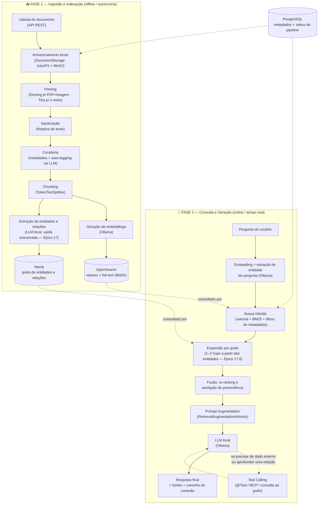

# Plano de Implementação — RAG Local com Spring Boot 4 + Spring AI

> Sistema de *Retrieval-Augmented Generation* 100% local, gratuito e open source, para fins de estudo e simulação de um ambiente real de produção.

**Autor:** Claude (atuando como Arquiteto de Soluções + Product Owner)
**Data:** Julho/2026
**Status:** Backlog inicial para planejamento — revisado após sessão de arquitetura (v5)

> **Nota de revisão (v2):** este documento foi atualizado após uma sessão de arquitetura sobre precisão de retrieval em escala — muitos documentos, múltiplos tenants — e sobre correlação de dados que a busca vetorial sozinha não captura. Duas mudanças estruturais entraram: **OpenSearch substitui o pgvector** como vector store (viabilizando busca híbrida vetorial + full-text nativamente, confirmada como necessária, não opcional), e um **Épico 17 novo** introduz um grafo de conhecimento (Neo4j) para relações entre entidades de negócio, detecção de lacunas de conteúdo ("dados que existem mas não foram indexados/conectados") e retrieval multi-hop. O restante do plano original — ingestão, parsing, sanitização, curadoria, chunking, geração, tool calling — segue como estava; as mudanças foram inseridas nos pontos exatos onde se encaixam, não como um documento à parte.

> **Nota de revisão (v3):** decisão de arquitetura sobre onde vivem os artefatos de documento ao longo do pipeline de ingestão — detalhada na **[ADR-001](ADRs/ADR-001-storage-artefatos-documento.md)**. Resumo: o arquivo bruto (Épico 1.4) e o texto extraído/sanitizado (Épico 2.4) passam a viver num `DocumentStorage` (port/adapter no módulo `shared`, com vocabulário fechado de estágio: `RAW`/`TRANSFORMED`/`SANITIZED`) implementado hoje em filesystem — um mount JuiceFS (metadados no Redis, dados no MinIO) montado via FUSE, não um cliente S3 direto nem uma tabela de staging no Postgres. O Postgres passa a guardar só a **referência** a cada estágio (`*_storage_key`) e metadado estruturado — nunca o conteúdo do texto. Isso substitui a redação original do Épico 2.4 ("tabela/coluna de staging") e o `storage_path` genérico da seção 6.1.

> **Nota de revisão (v4):** troca do parser de PDF/imagem — detalhada na **[ADR-002](ADRs/ADR-002-parsing-pdf-imagem-docling.md)**. Resumo: Docling (via `docling-java` + serviço `docling-serve`) substitui o `TikaDocumentReader` especificamente para PDF e imagem (Épico 2.1) — layout, OCR e estrutura de tabela melhores, inclusive em digitalizados. Tika continua como leitor universal para os demais formatos e para as duas outras finalidades que já tinha (detecção de MIME no upload — 1.2; metadados nativos — 2.2), que não são afetadas por esta troca. Isso adiciona `docling-serve` como um novo serviço no `compose.yaml`, rodando em CPU (a GPU do host já está reservada para o Ollama).

> **Nota de revisão (v5):** duas correções encontradas revisando a correlação entre a ingestão de dados e este plano. (1) **Embeddings via Ollama confirmados** — detalhado na **[ADR-003](ADRs/ADR-003-embeddings-via-ollama.md)**: o `pom.xml` usava `spring-ai-starter-model-transformers` (ONNX in-process) desde antes deste plano adotar ADRs, nunca refletido aqui; o Épico 6.1 sempre descreveu Ollama/`nomic-embed-text`, e essa é a decisão confirmada — corrigido agora para `spring-ai-starter-model-ollama`, com `OLLAMA_MAX_LOADED_MODELS=2` no `compose.yaml` pra manter os dois modelos (chat + embedding) residentes sem alternância. (2) **Épico 3.4 ganhou coluna própria** (`sanitized_text_length`, seção 6.1) — a redação anterior reaproveitava `extracted_text_length` (medido *antes* da sanitização) para detectar conteúdo vazio *depois* da sanitização, o que diverge quando mascaramento de PII/remoção de ruído encolhe bastante o texto.

---

## Sumário

1. [Visão Geral do Projeto](#1-visão-geral-do-projeto)
2. [Arquitetura da Solução](#2-arquitetura-da-solução)
3. [Stack Tecnológico](#3-stack-tecnológico)
4. [Backlog do Produto — Épicos e Prioridades](#4-backlog-do-produto--épicos-e-prioridades)
5. [Detalhamento dos Épicos e Tarefas](#5-detalhamento-dos-épicos-e-tarefas)
6. [Modelo de Dados](#6-modelo-de-dados)
7. [Estrutura de Pastas do Projeto](#7-estrutura-de-pastas-do-projeto)
8. [Docker Compose de Referência](#8-docker-compose-de-referência)
9. [Roadmap Sugerido (Sprints)](#9-roadmap-sugerido-sprints)
10. [Riscos e Pontos de Atenção](#10-riscos-e-pontos-de-atenção)
11. [Glossário](#11-glossário)
12. [Referências](#12-referências)

### Como usar este documento

- Cada **Épico** representa uma etapa macro do pipeline (ex.: ingestão, parsing, embeddings).
- Cada **Tarefa** `[N.M]` é um item de backlog atômico, com esforço estimado e critério de pronto (DoD).
- **Esforço:** `P` = Pequeno (horas) · `M` = Médio (meio a 1 dia) · `G` = Grande (vários dias).
- **Prioridade (MoSCoW):** `Must` = essencial para o MVP · `Should` = importante, mas não bloqueia · `Could` = desejável · `Backlog` = fora do escopo inicial, melhoria futura.

---

## 1. Visão Geral do Projeto

### 1.1 Objetivo

Construir, do zero, um sistema RAG (*Retrieval-Augmented Generation*) funcional e didático, capaz de:

- Ingerir documentos (PDF, DOCX, TXT, Markdown, HTML, CSV);
- Processá-los (parsing, limpeza, curadoria, metadados);
- Transformá-los em vetores semânticos (embeddings) e armazená-los;
- Responder perguntas em linguagem natural com base nesses documentos, citando fontes;
- Permitir que o modelo de IA local **use ferramentas** (function/tool calling) durante o raciocínio.

Tudo rodando **na sua máquina**, sem depender de APIs pagas (OpenAI, Anthropic, Gemini, etc.) e sem enviar nenhum dado para fora do seu ambiente.

### 1.2 Escopo e Premissas

| Premissa | Decisão |
|---|---|
| Custo | **Zero.** Nenhuma dependência paga, sem chaves de API externas. |
| Licenciamento | Todas as ferramentas devem ser open source (Apache 2.0, MIT ou similar). |
| Execução | 100% local, via Docker/Docker Compose. O único "custo" é hardware e energia. |
| IA | O LLM e o modelo de embeddings rodam localmente (Ollama), com suporte a *tool calling*. |
| Objetivo final | Aprendizado — a arquitetura simula um cenário real (multi-camadas, observável, testável), mas sem a complexidade de escala de produção (Kafka, Kubernetes, etc. ficam como "próximos passos"). |
| Framework | Spring (>= v4). Como está claríssimo hoje, isso significa a geração atual: **Spring Boot 4 / Spring Framework 7** (ver justificativa na seção 3). |
| Tenant | O sistema simula **um único tenant por base de conhecimento** (campo `knowledge_base`), mas todo o modelo — relacional e grafo — já nasce desenhado pra isolar dados por tenant desde a base (Épico 17.2), não como um filtro adicionado depois. |

### 1.3 O que é RAG, rapidamente

RAG combina **busca semântica** (recuperar trechos relevantes de uma base de conhecimento) com **geração de texto** (um LLM que usa esses trechos como contexto para responder). Isso resolve dois problemas dos LLMs "puros": desatualização do conhecimento e alucinação — porque a resposta passa a ser **fundamentada** (grounded) em documentos reais, que podem inclusive ser citados como fonte.

O projeto tem duas fases operacionais bem distintas, que também organizam o backlog abaixo:

- **Fase offline (indexação):** ingestão → parsing → sanitização → curadoria → chunking → embeddings → vector store.
- **Fase online (consulta):** pergunta → embedding da pergunta → busca por similaridade → montagem do prompt → LLM → resposta (com ou sem uso de ferramentas).

---

## 2. Arquitetura da Solução



> A diferença estrutural em relação à v1: antes, "recuperar contexto" era uma única caixa (busca por similaridade). Agora são três etapas em sequência (K → K2 → K3) porque são três problemas diferentes: achar o que é *parecido* (busca híbrida), achar o que é *relacionado* mas não necessariamente parecido (grafo), e decidir o que efetivamente entra no prompt sem estourar o contexto (fusão/re-ranking). Ver Épico 9 e Épico 17 para o detalhamento de cada etapa.

### Componentes principais

| Camada | Responsabilidade |
|---|---|
| **API REST (Spring MVC)** | Ponto de entrada para upload de documentos, consultas e status de processamento. |
| **Módulo de Ingestão/ETL** | Orquestra parsing → sanitização → curadoria → chunking → embedding → extração de entidades, usando as abstrações `DocumentReader` / `DocumentTransformer` / `DocumentWriter` do Spring AI. |
| **Armazenamento de artefatos (`DocumentStorage` sobre JuiceFS + MinIO)** | Guarda o arquivo bruto e o texto de cada estágio (`RAW`/`TRANSFORMED`/`SANITIZED` — ver ADR-001) via uma interface trocável; hoje resolve pra um filesystem montado via JuiceFS (metadados no Redis, dados no bucket do MinIO). |
| **PostgreSQL (metadados)** | Controle relacional: status do documento, **referências** aos artefatos em cold storage (não o conteúdo — ver ADR-001), metadados curados, versionamento, tenant (`knowledge_base`). Não guarda vetores nem texto de documento; é droga relacional pura de novo. |
| **OpenSearch (vetores + full-text)** | Guarda os *chunks*, seus vetores de embedding (k-NN) e o índice invertido de texto (BM25) na mesma engine — é o que viabiliza busca híbrida sem juntar dois motores de busca separados. Substitui o pgvector da v1. |
| **Neo4j (grafo de conhecimento)** | Guarda entidades de negócio extraídas do conteúdo e as relações entre elas, além de espelhar a estrutura tenant → documento → chunk. Responde perguntas de múltiplos saltos que nem busca vetorial nem full-text resolvem sozinhas, e permite detectar referências que apontam pra conteúdo ainda não indexado. |
| **Ollama** | Runtime de IA local: serve o modelo de chat (com tool calling) e o modelo de embeddings, via API HTTP compatível. |
| **Camada de Retrieval + Advisors (Spring AI)** | Orquestra a busca híbrida, a expansão por grafo, a fusão/re-ranking dos resultados e a montagem do prompt aumentado (RAG). |
| **Camada de Tools/MCP** | Expõe funções que o LLM pode chamar (cálculos, consultas ao grafo de entidades sob demanda, consultas a API interna simulada, e opcionalmente servidores MCP externos). |
| **Observabilidade** | Métricas, logs e tracing de toda a jornada (ingestão e consulta), incluindo recall comparado entre estratégias de retrieval (Épico 13.5). |

---

## 3. Stack Tecnológico

### 3.1 Sobre a versão do Spring

Você pediu "Spring Framework v4+". Vale um esclarecimento rápido como arquiteto: em julho/2026, a geração corrente do ecossistema é **Spring Boot 4.1 sobre Spring Framework 7.0**, e isso não é só "a mais nova" — é a única opção sensata para um projeto novo agora, porque:

- O Spring Boot 4.0 foi lançado em novembro/2025 (Spring Framework 7.0), e o Spring Boot 4.1 em junho/2026.
- O **Spring Boot 3.5 (última linha 3.x) encerrou o suporte open source em 30/06/2026** — ou seja, há poucos dias. Começar algo novo em cima do 3.x hoje significa nascer sem patches de segurança.
- O **Spring AI 2.0 foi lançado em GA em 12/06/2026** e **exige Spring Boot 4.0+** como dependência obrigatória — não roda sobre o 3.x.

Ou seja: "v4+" bate perfeitamente com a stack recomendada abaixo, e de quebra ainda é a mais atual e suportada.

> ⚠️ **Nota de transparência:** o Spring AI 2.0 GA tem poucas semanas de vida no momento deste plano. A API é estável (saiu de RC1 para GA), mas ainda existem menos tutoriais/StackOverflow do que para a 1.x. Ao implementar, vale sempre checar a [documentação oficial](https://docs.spring.io/spring-ai/reference/) e o changelog do GitHub antes de copiar exemplos antigos — a API de *tool calling*, por exemplo, mudou entre a 1.x e a 2.0 (ver Épico 11).

### 3.2 Stack completa

| Categoria | Tecnologia | Versão de referência | Por quê |
|---|---|---|---|
| Linguagem | **Java** | 21 (LTS) — 25 (LTS mais recente) também suportado | Baseline mínimo do Spring Boot 4 é Java 17; 21/25 liberam *virtual threads* e otimizações nativas. |
| Framework | **Spring Boot** | 4.1.x | Geração atual, suporte ativo, base para o Spring AI 2.0. |
| Núcleo | **Spring Framework** | 7.0.x | Vem embutido no Spring Boot 4.1. |
| Orquestração de IA | **Spring AI** | 2.0.x (GA) | Abstrações portáveis para ChatClient, EmbeddingModel, VectorStore, ETL de documentos, Advisors de RAG e Tool Calling. |
| Runtime de LLM local | **Ollama** | mais recente | Serve modelos open weight via API REST local, sem custo, com suporte nativo a tool calling. |
| Modelo de chat (com tools) | **Qwen3** (`qwen3:8b` como padrão) | — | Entre as famílias testadas, é a mais consistente em chamadas de ferramenta (tool calling confiável, baixo índice de JSON inválido), Apache 2.0, boa em português. Alternativas: `llama3.3`, `gemma4`, `gpt-oss:20b`. |
| Modelo de embeddings | **nomic-embed-text**, via Ollama | — | Leve (274 MB), 768 dimensões, ótimo custo-benefício pra retrieval — ver **ADR-003** (confirma esta escolha do plano original; `OLLAMA_MAX_LOADED_MODELS=2` evita alternância de modelo com o chat). Alternativa multilíngue mais forte (melhor para PT-BR), se a qualidade não bastar: `bge-m3` ou `qwen3-embedding`. |
| Banco relacional | **PostgreSQL** | 17+ | Guarda metadados e controle de pipeline (status, hash, versão, tenant). Não guarda mais vetores nesta versão — ver linha abaixo. |
| Vector + full-text store | **OpenSearch** | 2.x mais recente | Guarda vetores (k-NN) e índice invertido (BM25) na mesma engine, viabilizando busca híbrida nativa — a necessidade que motivou trocar do pgvector original. Suporte de primeira classe no Spring AI (`spring-ai-starter-vector-store-opensearch`). Custa mais RAM que o pgvector (ver seção 3.3) — é o preço da capacidade nova. |
| Grafo de conhecimento | **Neo4j** | 5.x (Community Edition) | Modela entidades de negócio e relações entre elas como estrutura nativa — o que o modelo relacional simula mal a partir de um certo grau de profundidade/variedade de relação (ver Épico 17). Community Edition é gratuita; recursos de cluster e múltiplos bancos por instância ficam historicamente na edição Enterprise, paga — **confirme na documentação atual antes de depender disso**, esse detalhe muda com frequência. |
| Armazenamento de arquivos | **MinIO + JuiceFS + Redis** | mais recente | MinIO guarda os bytes (S3 compatível). JuiceFS monta esse bucket como filesystem POSIX de verdade (metadados no Redis) — a app grava arquivo comum, sai objeto S3 por baixo. Ver ADR-001. |
| Parsing de PDF e imagem | **Docling Serve** (via `docling-java`) | v1.26.0 (imagem `-cpu`) | Layout, OCR e estrutura de tabela — melhor que Tika especificamente para PDF/imagem, inclusive digitalizados. Roda como serviço HTTP separado (não embarcado na JVM). Ver ADR-002. |
| Parsing dos demais formatos | **Apache Tika** (via `TikaDocumentReader`) | — | Extrai texto de DOCX, PPTX, HTML, RTF... com uma única API; continua sendo o leitor universal fora do escopo PDF/imagem. |
| Containers | **Docker + Docker Compose** | — | Sobe toda a infraestrutura local com um comando; Spring Boot 4 integra nativamente via `spring-boot-docker-compose`. |
| Testes de integração | **Testcontainers** (módulos `postgresql`, `opensearch`, `neo4j` e `ollama`) | — | Sobe Postgres, OpenSearch, Neo4j e Ollama reais durante os testes automatizados. |
| Documentação de API | **springdoc-openapi** | compatível com Boot 4 | Gera Swagger UI automaticamente a partir dos controllers. |
| Observabilidade | **Micrometer + OpenTelemetry + Prometheus + Grafana** | — | Métricas e tracing nativos do Spring Boot 4 (`spring-boot-starter-opentelemetry`) e do Spring AI (instrumenta ChatClient/Advisors automaticamente). |
| Build | **Maven** (ou Gradle, à sua escolha) | — | Convenção mais comum em tutoriais Spring. |

### 3.3 Requisitos de hardware (estimativa)

| Perfil de máquina | Modelo de chat sugerido | RAM/VRAM aproximada |
|---|---|---|
| Notebook modesto, sem GPU dedicada | `qwen3:8b` (quantizado Q4) + `nomic-embed-text`, ambos residentes no Ollama (`OLLAMA_MAX_LOADED_MODELS=2`) | ~8–10 GB RAM |
| Desktop com GPU 12–16 GB | `qwen3:8b` ou `gpt-oss:20b` | 12–16 GB VRAM |
| Desktop com GPU 24 GB+ | `qwen3:30b-a3b` (MoE) ou `qwen3:32b` | 24 GB+ VRAM |

Tudo funciona só em CPU também — mais lento, mas perfeitamente viável para aprendizado com poucos documentos.

> ⚠️ **Atualização de hardware (v2):** OpenSearch e Neo4j são dois processos JVM adicionais, cada um pedindo heap próprio (OpenSearch costuma precisar de uns 4GB+ pra ficar estável). Some isso ao Ollama já ocupando RAM/VRAM pro modelo, e o perfil "notebook modesto" da tabela acima aperta bastante — considere subir esses dois serviços com heap reduzido (`-Xms1g -Xmx1g` como ponto de partida) e ajustar conforme a folga real de memória.
>
> **Se o plano é rodar em nuvem (e não só local):** o custo dos três bancos não é parecido. Postgres é de longe o mais barato (tier pequeno de RDS/Cloud SQL, ou serverless quase gratuito tipo Neon/Supabase). Neo4j tem um tier gerenciado gratuito real (AuraDB Free) pra grafo pequeno/médio. **OpenSearch é o que mais pesa no orçamento** — nasceu pra cluster, e os serviços gerenciados cobram por nó; é o oposto do que a intuição "é só mais um índice" sugere. Se o orçamento de nuvem for um fator real, vale medir o custo do OpenSearch isoladamente antes de comprometer a arquitetura toda — não é motivo pra tirá-lo (a busca híbrida é um requisito confirmado deste projeto, não uma ideia em aberto), mas é a peça que merece o tier certo dimensionado com mais cuidado que as outras duas.

---

## 4. Backlog do Produto — Épicos e Prioridades

| # | Épico | Prioridade | Esforço total (aprox.) |
|---|---|---|---|
| 0 | Fundação: Ambiente e Setup | Must | M |
| 1 | Ingestão de Documentos | Must | M |
| 2 | Parsing e Extração de Conteúdo | Must | M |
| 3 | Sanitização e Limpeza de Dados | Must | M |
| 4 | Curadoria e Enriquecimento de Metadados | Should | M |
| 5 | Chunking (Fragmentação de Texto) | Must | P |
| 6 | Geração de Embeddings | Must | M |
| 7 | Armazenamento Vetorial (Vector Store) | Must | M |
| 8 | Orquestração do Pipeline de Ingestão (ETL) | Should | G |
| 9 | Pipeline de Recuperação (Retrieval) | Must | M |
| 10 | Geração Aumentada (RAG) | Must | G |
| 11 | Tool Calling / RAG Agêntico | Must | G |
| 12 | API REST e Interface | Must | M |
| 13 | Observabilidade e Avaliação de Qualidade | Could | M |
| 14 | Testes Automatizados | Should | M |
| 15 | Deploy Local Completo | Must | M |
| 16 | Backlog de Melhorias Futuras | Backlog | — |
| 17 | Grafo de Conhecimento e Entidades de Negócio | Should | G |

---

## 5. Detalhamento dos Épicos e Tarefas

### Épico 0 — Fundação: Ambiente e Setup do Projeto

> *User story:* Como desenvolvedor, eu quero ter toda a infraestrutura local rodando (banco, IA, storage) e o projeto Spring Boot criado, para que eu possa começar a implementar as funcionalidades sem fricção de ambiente.

**[0.1] Provisionar infraestrutura local via Docker** `[Esforço: M]`
Criar o `docker-compose.yml` inicial com PostgreSQL (imagem padrão, sem extensão de vetor — ver nota abaixo), Ollama e MinIO. Redis e o mount JuiceFS (que tornam o MinIO navegável como filesystem — ver ADR-001) entram junto quando o Épico 1.4 for alcançado, não precisam antecipar aqui. OpenSearch entra no Épico 7 e Neo4j no Épico 17, cada um quando sua tarefa de provisionamento for alcançada — não é necessário (nem recomendado) subir todos os serviços de uma vez no dia 0. O `docker-compose.yml` completo, com todos os serviços já somados, está na seção 8 como referência do estado final — mas o `compose.yaml` real do repositório já é a fonte da verdade em caso de divergência (versões de imagem, limites de recurso, hostnames e afins evoluem lá primeiro).
- Definir volumes persistentes para não perder dados entre restarts
- Definir healthchecks para o Postgres e o Ollama
- Validar que as portas não conflitam com outros serviços da máquina
✅ **DoD:** `docker compose up` sobe os três serviços saudáveis. · 🛠 **Stack:** Docker Compose.

**[0.2] Baixar e validar os modelos de IA no Ollama** `[Esforço: P]`
Fazer o pull do modelo de chat e do modelo de embeddings escolhidos, e testar via `curl` na API do Ollama. Os dois ficam residentes ao mesmo tempo (`OLLAMA_MAX_LOADED_MODELS=2` — ver ADR-003), não alternam.
- `ollama pull qwen3:8b`
- `ollama pull nomic-embed-text`
- Testar `/api/chat` e `/api/embed` manualmente
✅ **DoD:** ambos os modelos respondem localmente via HTTP. · 🛠 **Stack:** Ollama.

**[0.3] Criar o projeto Spring Boot base** `[Esforço: P]`
Gerar o projeto via [start.spring.io](https://start.spring.io) com Java 21, Spring Boot 4.1, e as dependências iniciais: Web, Spring AI (Ollama), Data JPA, JDBC, Actuator, Validation. A dependência do vector store (`spring-ai-starter-vector-store-opensearch`) entra quando o Épico 7 for implementado, e a do Neo4j quando o Épico 17 for implementado — não precisa antecipar no esqueleto do projeto.
- Confirmar as versões geradas no `pom.xml`
- Importar o `spring-ai-bom` no `dependencyManagement`
✅ **DoD:** projeto sobe com `./mvnw spring-boot:run` sem erros. · 🛠 **Stack:** Spring Initializr, Maven.

**[0.4] Configurar `application.yml` e integração com Docker Compose** `[Esforço: P]`
Configurar as propriedades de conexão (datasource, Ollama base-url) e habilitar `spring-boot-docker-compose` para que o Spring suba a infra automaticamente em modo dev.
- Configurar `pull-model-strategy: when_missing` (Spring AI puxa o modelo automaticamente se faltar)
- Separar perfis `dev` e `local` se fizer sentido
✅ **DoD:** `./mvnw spring-boot:run` sobe a aplicação **e** a infraestrutura junto, sem passos manuais. · 🛠 **Stack:** Spring Boot Docker Compose support.

**[0.5] Estrutura de versionamento e documentação inicial** `[Esforço: P]`
Criar repositório Git, `.gitignore` adequado (ignorar `target/`, `.env`, volumes), e um `README.md` inicial com visão geral do projeto.
- Definir convenção de commits (opcional, ex.: Conventional Commits)
✅ **DoD:** repositório criado, primeiro commit com o esqueleto do projeto. · 🛠 **Stack:** Git.

---

### Épico 1 — Ingestão de Documentos

> *User story:* Como usuário, eu quero enviar documentos para o sistema de forma confiável e sem duplicidade, para que eles fiquem disponíveis para processamento.

**[1.1] Endpoint de upload de documentos** `[Esforço: P]`
Criar `POST /api/v1/documents`, recebendo arquivo via `multipart/form-data`.
- Aceitar PDF, DOCX, TXT, MD, HTML, CSV
- Retornar `202 Accepted` com o ID do documento e status `PENDING`
✅ **DoD:** upload funcional, documento registrado com status inicial. · 🛠 **Stack:** Spring Web.

**[1.2] Validação de entrada** `[Esforço: P]`
Validar tipo de arquivo (MIME sniffing real, não apenas extensão), tamanho máximo e presença de conteúdo.
- Configurar `spring.servlet.multipart.max-file-size`
- Rejeitar arquivos vazios ou tipos não suportados com `400 Bad Request` explicativo
✅ **DoD:** uploads inválidos são rejeitados com mensagem clara. · 🛠 **Stack:** Apache Tika (detecção de MIME), Bean Validation.

**[1.3] Deduplicação via hash** `[Esforço: P]`
Calcular SHA-256 do arquivo antes de salvar; se já existir um documento com o mesmo hash, não reprocessar.
- Coluna `file_hash_sha256` única na tabela `documents`
✅ **DoD:** reenviar o mesmo arquivo não gera um novo processamento duplicado. · 🛠 **Stack:** Java `MessageDigest`.

**[1.4] Armazenamento do arquivo bruto** `[Esforço: M]`
Persistir o arquivo original via `DocumentStorage.store(RAW, ...)` (módulo `shared`) — não um cliente S3 chamado direto do controller (redação original, revista pela **ADR-001**). Hoje isso grava num filesystem montado via JuiceFS (metadados no Redis, dados no bucket `blobstore` do MinIO — ver `compose.yaml`); trocar por um cliente S3 direto no futuro não deve exigir mudança em quem consome a interface.
- Guardar a `raw_storage_key` retornada na tabela de metadados, não um caminho/URL cru
✅ **DoD:** arquivo enviado aparece como objeto real no bucket do MinIO e a `raw_storage_key` é rastreável a partir do registro do documento. · 🛠 **Stack:** `DocumentStorage`, JuiceFS, Redis, MinIO.

**[1.5] Registro inicial de metadados e máquina de estados** `[Esforço: M]`
Criar a entidade/tabela `documents` com os campos de controle (ver seção 6) e um enum de status representando o ciclo de vida do pipeline.
- Estados: `PENDING → PARSING → CLEANING → ENRICHING → CHUNKING → EMBEDDING → INDEXED` (ou `FAILED` em qualquer etapa)
✅ **DoD:** cada documento tem um registro rastreável do início ao fim do pipeline. · 🛠 **Stack:** Spring Data JPA.

---

### Épico 2 — Parsing e Extração de Conteúdo

> *User story:* Como sistema, eu preciso converter arquivos de formatos variados em texto estruturado, para que o conteúdo possa ser processado de forma uniforme independentemente do formato original.

**[2.1] Configurar `DocumentReader` por tipo de arquivo** `[Esforço: M]`
Implementar uma factory que escolhe o `DocumentReader` correto conforme o `content-type` detectado.
- **PDF e imagem (PNG, TIFF, JPEG...): `DoclingPdfDocumentReader`**, customizado, fala com o serviço `docling-serve` (layout, OCR, estrutura de tabela) — substitui o `TikaDocumentReader` para esses formatos. Ver **ADR-002**.
- `MarkdownDocumentReader` para `.md` (preserva estrutura de headers)
- `TikaDocumentReader` continua sendo o leitor universal para os demais formatos (DOCX, PPTX, RTF, HTML...) onde a qualidade de layout/OCR não é um requisito
- Leitor dedicado para CSV/JSON quando fizer sentido manter colunas/campos como metadados
✅ **DoD:** cada tipo de arquivo suportado é convertido em uma lista de `Document` (texto + metadados); PDF/imagem passam por OCR e reconhecem tabelas mesmo em documentos escaneados. · 🛠 **Stack:** Spring AI ETL (`DocumentReader`), Docling Serve, Apache Tika (formatos não-PDF/imagem).

**[2.2] Extração de metadados nativos do arquivo** `[Esforço: P]`
Aproveitar os metadados que o próprio Tika extrai (autor, data de criação, número de páginas, título) e gravá-los junto ao documento.
- Mapear metadados do Tika para o schema de metadados do projeto (seção 6)
✅ **DoD:** metadados nativos (quando existentes) aparecem na base sem intervenção manual. · 🛠 **Stack:** Apache Tika Metadata API.

**[2.3] Tratamento de falhas de parsing** `[Esforço: M]`
Capturar exceções de arquivos corrompidos, protegidos por senha ou digitalizados sem OCR (PDF só-imagem), marcando o documento como `FAILED` com uma mensagem de erro legível.
- Log estruturado do erro (ver Épico 13)
- Endpoint para o usuário consultar o motivo da falha
✅ **DoD:** nenhuma falha de parsing derruba o pipeline como um todo; o erro fica registrado e visível. · 🛠 **Stack:** tratamento de exceções Spring, logging.

**[2.4] Persistir texto extraído em cold storage** `[Esforço: P]`
Gravar o texto extraído (antes da sanitização) via `DocumentStorage.store(TRANSFORMED, ...)` — não numa tabela/coluna de staging (redação original, revista pela **ADR-001**). O Postgres guarda só a `transformed_storage_key` retornada e o `extracted_text_length`, não o texto.
✅ **DoD:** é possível abrir o artefato `TRANSFORMED` de qualquer documento (via a referência gravada) e compará-lo com o artefato `SANITIZED` equivalente. · 🛠 **Stack:** `DocumentStorage` (módulo `shared`), PostgreSQL (referência + tamanho).

---

### Épico 3 — Sanitização e Limpeza de Dados

> *User story:* Como responsável pela qualidade dos dados, eu quero que o texto extraído seja normalizado e livre de ruído, para que os embeddings gerados representem o conteúdo real, e não artefatos de formatação.

**[3.1] Normalização de encoding e caracteres de controle** `[Esforço: P]`
Garantir UTF-8 em toda a pipeline; remover caracteres de controle não imprimíveis e normalizar espaços/quebras de linha.
✅ **DoD:** texto sanitizado não contém bytes inválidos nem sequências de espaços/linhas excessivas. · 🛠 **Stack:** Java `Normalizer`, regex.

**[3.2] Remoção de ruído estrutural** `[Esforço: M]`
Remover headers/footers repetidos, numeração de página e marcas d'água textuais recorrentes, usando heurísticas (ex.: linhas que se repetem em >70% das páginas de um mesmo documento).
✅ **DoD:** amostragem manual de 5 documentos mostra queda perceptível de ruído repetitivo. · 🛠 **Stack:** `DocumentTransformer` customizado (Spring AI).

**[3.3] Mascaramento de dados sensíveis (PII)** `[Esforço: M]`
Aplicar detecção baseada em regex para CPF, e-mail, telefone e RG, substituindo por placeholders (ex.: `[CPF_MASCARADO]`) antes da indexação.
- Deixar configurável por tipo de documento (nem todo documento precisa de mascaramento)
✅ **DoD:** documentos de teste com PII sintética não expõem os dados originais após o processamento. · 🛠 **Stack:** regex Java. *(Avançado: Microsoft Presidio como alternativa mais robusta — ver Épico 16.)*

**[3.4] Validação mínima de conteúdo** `[Esforço: P]`
Marcar como `FAILED` documentos que, após a limpeza, ficarem vazios ou muito curtos (ex.: menos de 50 caracteres) — sinal de parsing malsucedido ou de sanitização excessivamente agressiva (mascaramento de PII/remoção de ruído que devorou o texto). Checagem via `sanitized_text_length` (tamanho pós-limpeza, coluna própria — não o `extracted_text_length` do 2.4, que mede o texto *antes* da sanitização e pode divergir bastante do tamanho final), sem precisar reabrir o artefato em cold storage.
✅ **DoD:** documentos "vazios" não avançam silenciosamente para as próximas etapas. · 🛠 **Stack:** validação de negócio simples.

---

### Épico 4 — Curadoria e Enriquecimento de Metadados

> *User story:* Como curador de conteúdo, eu quero que cada documento tenha metadados ricos e, quando possível, gerados automaticamente pela IA, para que as buscas futuras possam ser filtradas e mais precisas.

**[4.1] Definir o schema de metadados padrão** `[Esforço: P]`
Formalizar quais campos todo documento (e cada chunk) deve carregar: `categoria`, `tags`, `idioma`, `autor`, `fonte`, `nível de confidencialidade`, `versão`.
✅ **DoD:** schema documentado e usado como contrato entre as etapas do pipeline. · 🛠 **Stack:** documentação (este próprio plano + Javadoc/records).

**[4.2] Auto-tagging e sumarização via LLM local** `[Esforço: G]`
Usar o próprio modelo de chat do Ollama para ler o documento (ou um resumo dele) e gerar automaticamente: categoria sugerida, lista de tags e um resumo curto — usando *structured output* do Spring AI para garantir JSON válido.
- Prompt dedicado, com poucos exemplos (few-shot) para estabilizar o formato
- Persistir resultado como sugestão, não como verdade absoluta (ver tarefa 4.3)
✅ **DoD:** todo documento novo recebe tags e resumo gerados automaticamente antes da curadoria manual. · 🛠 **Stack:** Spring AI `ChatClient` + `BeanOutputConverter`/structured output, Ollama.

**[4.3] Endpoint de curadoria manual** `[Esforço: M]`
Criar `PATCH /api/v1/documents/{id}/metadata`, permitindo revisar/corrigir os metadados sugeridos pela IA antes do documento avançar para indexação (simulando um fluxo *human-in-the-loop*).
✅ **DoD:** é possível aceitar, editar ou rejeitar as sugestões da IA antes do chunking. · 🛠 **Stack:** Spring Web.

**[4.4] Versionamento de documentos** `[Esforço: M]`
Ao reenviar um documento já existente (mesmo `source`, hash diferente), criar uma nova versão, mantendo rastreabilidade e removendo os *chunks* antigos do vector store na reindexação.
✅ **DoD:** reprocessar um documento atualizado não deixa "lixo" de versões antigas na busca. · 🛠 **Stack:** coluna `version`, lógica de upsert no vector store (ver 7.3).

---

### Épico 5 — Chunking (Fragmentação de Texto)

> *User story:* Como sistema de busca, eu preciso que os documentos sejam divididos em pedaços de tamanho adequado, para que a busca por similaridade encontre trechos relevantes e específicos, sem perder contexto.

**[5.1] Configurar a estratégia de chunking** `[Esforço: P]`
Usar o `TokenTextSplitter` do Spring AI como `DocumentTransformer` padrão.
- Definir tamanho alvo (ex.: 800 tokens) e overlap (ex.: 100–150 tokens) entre chunks consecutivos
✅ **DoD:** documentos longos são divididos em múltiplos `Document` (chunks) coerentes. · 🛠 **Stack:** Spring AI `TokenTextSplitter`.

**[5.2] Preservar herança de metadados por chunk** `[Esforço: P]`
Garantir que cada chunk herde os metadados do documento pai (categoria, fonte, autor) e ganhe metadados próprios (`chunk_index`, `document_id`).
✅ **DoD:** dado um chunk qualquer no vector store, é possível voltar ao documento original e à sua posição nele. · 🛠 **Stack:** Spring AI `Document.metadata`.

**[5.3] Tratamento especial para tabelas e listas** `[Esforço: M]`
Evitar que o splitter corte tabelas ou listas no meio; quando identificado esse tipo de estrutura, considerar chunk dedicado por bloco.
✅ **DoD:** amostragem manual mostra que tabelas simples não ficam fragmentadas de forma ilegível. · 🛠 **Stack:** lógica de pré-processamento customizada. *(Pode ficar como melhoria incremental — ver Épico 16 para OCR/tabelas complexas.)*

---

### Épico 6 — Geração de Embeddings

> *User story:* Como sistema de busca semântica, eu preciso transformar cada chunk de texto em um vetor numérico, para que documentos com significado semelhante fiquem "próximos" no espaço vetorial.

**[6.1] Configurar o `EmbeddingModel`** `[Esforço: P]`
Configurar o Spring AI para usar o Ollama como provedor de embeddings (`nomic-embed-text`), via `application.yml` — confirmado pela **ADR-003** (qualidade de retrieval pesa mais que o custo de acoplamento; `OLLAMA_MAX_LOADED_MODELS=2` evita alternância de modelo com o chat).
✅ **DoD:** chamar o `EmbeddingModel` a partir de um teste unitário retorna um vetor de 768 posições. · 🛠 **Stack:** Spring AI (`spring-ai-starter-model-ollama`).

**[6.2] Geração em lote (batch) dos embeddings** `[Esforço: M]`
Processar os chunks em lotes (ex.: 20 por vez) para não sobrecarregar o Ollama, com *retry* simples em caso de timeout.
✅ **DoD:** um documento com centenas de chunks é totalmente embedado sem estourar timeout nem travar a aplicação. · 🛠 **Stack:** Spring `@Async`, `EmbeddingModel.embed(List)`.

**[6.3] Cache/deduplicação de embeddings** `[Esforço: M]`
Antes de gerar o embedding de um chunk, verificar se já existe um chunk idêntico (mesmo hash de conteúdo) já embedado, reaproveitando o vetor.
✅ **DoD:** reprocessar conteúdo repetido não gera chamadas desnecessárias ao modelo. · 🛠 **Stack:** hash SHA-256 do texto do chunk.

**[6.4] Testes de sanidade dimensional** `[Esforço: P]`
Escrever testes garantindo que a dimensão do vetor gerado bate com a configurada no vector store (evita o erro clássico de trocar de modelo de embedding e esquecer de atualizar o schema).
✅ **DoD:** teste automatizado falha explicitamente se as dimensões não baterem. · 🛠 **Stack:** JUnit 5.

---

### Épico 7 — Armazenamento Vetorial e Full-Text (OpenSearch)

> *User story:* Como sistema, eu preciso armazenar os vetores e o texto de forma que consultas por similaridade **e** por termo exato sejam rápidas mesmo com muitos documentos, para que a busca escale razoavelmente e não dependa de uma única estratégia de recuperação.
>
> **Por que OpenSearch e não pgvector (que era a escolha da v1 deste plano):** o motivo não é performance — é capacidade. pgvector faz busca vetorial muito bem, mas busca por termo exato (um código de contrato, uma sigla, um nome próprio) em cima dele é um `tsvector` manual, tratado como recurso avançado. OpenSearch nasceu como motor de busca (Lucene/BM25) e ganhou k-NN depois — então as duas buscas são cidadãs de primeira classe na mesma engine, e a fusão dos dois resultados (Épico 9.4) é o caminho principal, não um apêndice. O custo dessa troca é operacional, não técnico: mais um processo JVM pesado rodando (ver nota de hardware na seção 3.3) e a pegadinha clássica do `vm.max_map_count` no Linux (ver seção 8).

**[7.1] Provisionar OpenSearch** `[Esforço: P]`
Subir o container do OpenSearch (ver `docker-compose.yml` na seção 8) e confirmar que o cluster fica saudável em modo single-node (sem necessidade de múltiplos nós para um ambiente de estudo).
- No Linux, ajustar `vm.max_map_count=262144` no host **antes** de subir o container — sem isso, o OpenSearch simplesmente não inicializa, e o erro no log não deixa óbvio que é esse o motivo
✅ **DoD:** `curl http://localhost:9200/_cluster/health` retorna status `green` ou `yellow`. · 🛠 **Stack:** Docker, OpenSearch.

**[7.2] Configurar o `OpenSearchVectorStore` do Spring AI** `[Esforço: M]`
Configurar `spring.ai.vectorstore.opensearch` apontando pro índice de chunks, com mapeamento `knn_vector` de 768 dimensões (conforme o modelo de embedding escolhido) e `similarity-function: cosine`.
- Exemplo de mapeamento do índice, pra referência (o Spring AI cria algo equivalente automaticamente, mas vale entender o que está sendo criado por baixo):
```json
PUT /rag-chunks
{
  "settings": { "index": { "knn": true } },
  "mappings": {
    "properties": {
      "content":        { "type": "text" },
      "embedding":      { "type": "knn_vector", "dimension": 768 },
      "document_id":    { "type": "keyword" },
      "chunk_index":    { "type": "integer" },
      "category":       { "type": "keyword" },
      "knowledge_base": { "type": "keyword" }
    }
  }
}
```
✅ **DoD:** o índice é criado automaticamente na subida da aplicação, com os campos de metadado necessários para filtro (Épico 9.3) mapeados como `keyword` (não `text` — senão o filtro exato quebra silenciosamente e vira busca textual). · 🛠 **Stack:** `spring-ai-starter-vector-store-opensearch`.

**[7.3] Estratégia de upsert/delete ao reprocessar documentos** `[Esforço: M]`
Ao reindexar uma nova versão de um documento, remover primeiro os documentos antigos do índice (filtrando por `document_id`) antes de inserir os novos — mesma lógica da v1, API diferente.
✅ **DoD:** reindexar um documento não duplica chunks nem deixa órfãos de versões antigas. · 🛠 **Stack:** `VectorStore.delete(filterExpression)`.

**[7.4] Particionamento lógico por tenant** `[Esforço: M]`
O campo `knowledge_base` (mapeado como `keyword`, ver 7.2) já isola tenants dentro do mesmo índice — mas isolamento por *filtro que a aplicação precisa lembrar de aplicar* é frágil por natureza (um retriever novo, escrito sem essa linha, vaza dado de outro tenant silenciosamente). Auditar, nesta tarefa, que **todo** ponto de leitura do índice passa por esse filtro — não só os óbvios.
✅ **DoD:** uma varredura no código confirma que não existe nenhuma query ao OpenSearch sem filtro de `knowledge_base`. · 🛠 **Stack:** `FilterExpressionBuilder`, revisão de código.

---

### Épico 8 — Orquestração do Pipeline de Ingestão (ETL completo)

> *User story:* Como sistema, eu quero que todas as etapas de processamento (parsing → sanitização → curadoria → chunking → embedding → indexação) aconteçam de forma encadeada e resiliente, para que uma falha em uma etapa não corrompa o pipeline inteiro nem trave a aplicação.

**[8.1] Orquestrar o fluxo ponta a ponta** `[Esforço: G]`
Montar o pipeline completo conectando os `DocumentReader` → `DocumentTransformer` (sanitização, enriquecimento, chunking) → `DocumentWriter` (vector store) do Spring AI, com atualização de status a cada etapa.
✅ **DoD:** enviar um documento via upload resulta, sem intervenção manual, em chunks pesquisáveis no vector store. · 🛠 **Stack:** Spring AI ETL Pipeline.

**[8.2] Processamento assíncrono com máquina de estados** `[Esforço: M]`
Disparar o processamento via `@Async` + eventos Spring (`ApplicationEventPublisher`), desacoplando o upload (resposta rápida ao usuário) do processamento pesado (em background).
✅ **DoD:** o upload responde em milissegundos, e o processamento continua em background de forma rastreável pelo status. · 🛠 **Stack:** Spring Events, `@Async`.

**[8.3] Tratamento de falhas parciais** `[Esforço: M]`
Definir política de retry (ex.: 3 tentativas com backoff) para falhas transitórias (ex.: Ollama temporariamente indisponível), e marcar como `FAILED` com log detalhado após esgotar as tentativas.
✅ **DoD:** uma indisponibilidade momentânea do Ollama não perde o documento — ele é reprocessado automaticamente. · 🛠 **Stack:** Spring Retry.

**[8.4] Endpoint de consulta de status** `[Esforço: P]`
Criar `GET /api/v1/documents/{id}/status`, retornando o estágio atual do pipeline e, se aplicável, a mensagem de erro.
✅ **DoD:** o usuário consegue acompanhar o progresso de qualquer documento enviado. · 🛠 **Stack:** Spring Web.

---

### Épico 9 — Pipeline de Recuperação (Retrieval)

> *User story:* Como usuário, eu quero que, ao fazer uma pergunta, o sistema encontre os trechos de documentos mais relevantes, para que a resposta final seja baseada em informação real e específica.

**[9.1] Endpoint de busca semântica "pura"** `[Esforço: P]`
Criar `POST /api/v1/search`, que recebe uma pergunta, gera o embedding dela e retorna os chunks mais similares (sem passar pelo LLM ainda) — útil para depurar a qualidade da recuperação isoladamente da geração.
✅ **DoD:** é possível validar a qualidade da busca sem o "ruído" da geração de texto. · 🛠 **Stack:** `VectorStore.similaritySearch`.

**[9.2] Busca por similaridade com top-K e threshold configuráveis** `[Esforço: P]`
Parametrizar quantos resultados retornar (`topK`) e o limiar mínimo de similaridade (`similarityThreshold`) via request ou configuração padrão.
✅ **DoD:** ajustar `topK`/`threshold` muda o resultado de forma previsível. · 🛠 **Stack:** `VectorStoreDocumentRetriever` (Spring AI).

**[9.3] Filtros por metadados** `[Esforço: M]`
Permitir restringir a busca por categoria, fonte, idioma ou `knowledge_base`, usando o `FilterExpressionBuilder` do Spring AI (equivalente a um `WHERE` sobre os campos `keyword` mapeados no índice do OpenSearch — ver seção 6.2).
✅ **DoD:** buscar "somente em documentos da categoria X" retorna apenas chunks daquela categoria. · 🛠 **Stack:** `FilterExpressionBuilder`.

**[9.4] Busca híbrida (vetorial + full-text)** `[Esforço: G]`
Combinar, numa mesma consulta ao OpenSearch, a busca por similaridade (k-NN) com busca textual tradicional (BM25), útil para termos exatos (siglas, códigos, nomes próprios) que a busca semântica pode não priorizar bem.
- Duas formas de fazer a fusão: usar o *search pipeline* nativo do OpenSearch (normaliza e combina os dois scores no próprio servidor) ou rodar as duas buscas separadamente e combinar no código com uma técnica de fusão por ranking (ex.: *Reciprocal Rank Fusion* — soma `1/(k + posição)` de cada resultado nas duas listas, sem precisar normalizar escalas de score diferentes)
- Exemplo do tipo de pergunta que valida esta tarefa: buscar pelo código `PROC-2024-4521` deve retornar o chunk certo mesmo que a similaridade semântica pura não o coloque no topo
✅ **DoD:** uma consulta por um termo exato aparece nos resultados mesmo quando a similaridade semântica pura não o prioriza, sem prejudicar a qualidade das buscas puramente semânticas. · 🛠 **Stack:** OpenSearch hybrid search / search pipeline.

**[9.5] Integração com expansão por grafo de entidades** `[Esforço: G]`
A partir dos chunks retornados pela busca híbrida (9.4), identificar quais entidades eles mencionam, expandir 1–2 saltos no grafo de conhecimento (Neo4j) e trazer chunks adicionais conectados por relação — mesmo que semanticamente distantes da pergunta original. Ver **Épico 17.6** para o detalhamento completo desta integração (é o mesmo mecanismo, só documentado lá porque depende do grafo já existir).
✅ **DoD:** uma pergunta cuja resposta completa exige juntar dois documentos sem vocabulário parecido entre si retorna os dois. · 🛠 **Stack:** Spring AI `RetrievalAugmentationAdvisor`, Neo4j.

**[9.6] Re-ranking com cross-encoder** `[Esforço: M]`
Refinar os candidatos combinados (busca híbrida + expansão por grafo) com um modelo especializado em relevância antes de montar o prompt final — importante porque, com duas fontes de retrieval somadas, o número de candidatos cresce, e nem todos merecem entrar no contexto final.
- Estratégia: buscar um conjunto maior (ex.: top-50) nas etapas anteriores, e usar o cross-encoder só pra afunilar pros 5–10 que de fato vão pro prompt — caro demais pra rodar em todo o corpus, barato o suficiente pra rodar num conjunto já pré-filtrado
✅ **DoD:** comparando manualmente 10 perguntas, o conjunto final pós re-ranking é subjetivamente mais relevante que o topK bruto das etapas anteriores. · 🛠 **Stack:** modelo cross-encoder local (via Ollama ou biblioteca dedicada, a definir na implementação).

---

### Épico 10 — Geração Aumentada (RAG)

> *User story:* Como usuário, eu quero fazer perguntas em linguagem natural e receber respostas fundamentadas nos documentos indexados — com indicação de fonte, e sem o sistema "inventar" informação que não está na base.

**[10.1] RAG ingênuo com `QuestionAnswerAdvisor`** `[Esforço: M]`
Implementar a primeira versão funcional do chat RAG usando o advisor pronto do Spring AI, que já faz busca + montagem de prompt automaticamente.
```java
var chatClient = ChatClient.builder(chatModel)
    .defaultAdvisors(QuestionAnswerAdvisor.builder(vectorStore).build())
    .build();
```
✅ **DoD:** perguntar algo relacionado a um documento indexado retorna uma resposta coerente com o conteúdo. · 🛠 **Stack:** Spring AI `ChatClient` + `QuestionAnswerAdvisor`.

**[10.2] Prompt template com instruções de *grounding*** `[Esforço: P]`
Customizar o template de prompt para instruir explicitamente o modelo a **responder "não sei" quando o contexto não for suficiente**, reduzindo alucinação.
✅ **DoD:** perguntas fora do escopo dos documentos indexados resultam em "não tenho essa informação", não em resposta inventada. · 🛠 **Stack:** `PromptTemplate` customizado.

**[10.3] Citação de fontes na resposta** `[Esforço: M]`
Retornar, junto da resposta, quais documentos/chunks foram usados como contexto (nome do arquivo, trecho, score de similaridade).
✅ **DoD:** toda resposta gerada vem acompanhada de uma lista de fontes rastreáveis. · 🛠 **Stack:** metadados dos `Document` retornados pelo advisor.

**[10.4] Streaming de resposta (SSE)** `[Esforço: M]`
Expor a resposta via *Server-Sent Events*, para que o texto apareça token a token (experiência tipo ChatGPT), em vez de esperar a resposta completa.
✅ **DoD:** o cliente recebe a resposta incrementalmente. · 🛠 **Stack:** Spring WebFlux/`Flux<String>`, `ChatClient.stream()`.

**[10.5] Evoluir para `RetrievalAugmentationAdvisor` (RAG modular)** `[Esforço: G]`
Substituir o RAG ingênuo por uma versão modular, adicionando *query rewriting* (reescreve a pergunta do usuário para melhorar a busca) e possibilidade de pós-processamento dos documentos recuperados (compressão/re-ranking).
```java
var advisor = RetrievalAugmentationAdvisor.builder()
    .queryTransformers(RewriteQueryTransformer.builder()
        .chatClientBuilder(chatClientBuilder.build().mutate()).build())
    .documentRetriever(VectorStoreDocumentRetriever.builder()
        .similarityThreshold(0.5).vectorStore(vectorStore).build())
    .build();
```
✅ **DoD:** perguntas mal formuladas ou muito curtas ainda retornam contexto relevante, graças à reescrita automática. · 🛠 **Stack:** Spring AI `RetrievalAugmentationAdvisor`, `RewriteQueryTransformer`.

> É exatamente aqui, no hook de pós-processamento que esta tarefa já prevê, que a expansão por grafo (9.5 / 17.6) e a fusão híbrida (9.4) se encaixam — não como pipeline paralela, como retriever/pós-processador adicional dentro desta mesma abstração.

**[10.6] Anotação de proveniência no contexto** `[Esforço: M]`
Estender a citação de fontes (10.3) para registrar *por que* cada chunk entrou no contexto: `"similaridade_direta"` (veio da busca híbrida) ou `"relacionado_via_grafo"` (veio da expansão de entidade), incluindo, neste segundo caso, qual entidade e qual relação motivaram a inclusão.
- Exemplo do que isso habilita na resposta final: *"Encontrei esse risco no Relatório de Mercado — ele não menciona a Empresa Y diretamente, mas foi trazido porque a Empresa Z, citada no seu contrato, compete com ela."*
✅ **DoD:** toda fonte citada distingue se veio por similaridade direta ou por relação no grafo, e no segundo caso mostra qual. · 🛠 **Stack:** metadados customizados no `Document`, propagados pelo `DocumentPostProcessor`.

**[10.7] Grounding de três modos** `[Esforço: M]`
Estender o prompt de grounding (10.2), que hoje só sabe responder ou dizer "não sei quando não achou nada", para um terceiro modo: **"sei parte, e sei que falta parte"**. Isso usa diretamente a detecção de referência não resolvida do Épico 17.5 — se o contexto recuperado contém uma referência cruzada (`"conforme Anexo B"`) que não resolveu para nenhum documento existente, o prompt precisa instruir o modelo a mencionar essa lacuna explicitamente, em vez de responder como se a informação disponível fosse completa.
✅ **DoD:** perguntar sobre algo parcialmente coberto, com uma referência pendente identificada, produz uma resposta que menciona tanto o que foi encontrado quanto o que parece faltar. · 🛠 **Stack:** `PromptTemplate` customizado, dados do Épico 17.5.

---

### Épico 11 — Tool Calling / RAG Agêntico

> *User story:* Como usuário, eu quero que a IA local consiga usar ferramentas (funções) quando a pergunta exigir algo além do texto indexado — como um cálculo, uma consulta a uma API, ou a data atual — para que o sistema seja mais útil do que um "buscador de texto burro".

> ⚠️ Importante: no Spring AI 2.0, o **loop automático de execução de tools embutido no `ChatModel` foi removido**. A execução de tools agora acontece via `ChatClient` + advisor de tool calling (auto-registrado), e as tools precisam ser registradas como beans `ToolCallback` explícitos — não mais resolvidas por nome de bean em tempo de execução. As tarefas abaixo já seguem esse modelo atual.

**[11.1] Definir tools customizadas com `@Tool`** `[Esforço: M]`
Criar pelo menos 2–3 ferramentas simples e úteis para testar o mecanismo: data/hora atual, uma calculadora simples, e uma consulta a uma "API interna" simulada (ex.: status de um pedido fictício).
```java
@Tool(description = "Retorna a data e hora atual no fuso do servidor")
String obterDataHoraAtual() { return LocalDateTime.now().toString(); }
```
✅ **DoD:** cada tool tem uma descrição clara o suficiente para o modelo decidir quando usá-la. · 🛠 **Stack:** Spring AI `@Tool`.

**[11.2] Registrar as tools no `ChatClient` e validar o loop** `[Esforço: M]`
Registrar as tools como `ToolCallback` beans e passá-las via `.tools(...)` no `ChatClient`, testando perguntas que exigem uso explícito de ferramenta.
✅ **DoD:** perguntar "que horas são?" aciona a tool correta e a resposta reflete o retorno real da função, não um palpite do modelo. · 🛠 **Stack:** Spring AI `ToolCallback`, `ChatClient.tools()`.

**[11.3] Validar o suporte a tool calling do modelo escolhido** `[Esforço: P]`
Rodar `ollama show <modelo>` e confirmar a capability `tools` antes de assumir que um modelo suporta chamadas de função — nem todo modelo do Ollama suporta (ex.: Gemma 3 não suporta; Gemma 4 sim).
✅ **DoD:** documentado no README qual(is) modelo(s) foram validados com tool calling neste projeto. · 🛠 **Stack:** Ollama CLI.

**[11.4] Integração com MCP (Model Context Protocol) — avançado** `[Esforço: G]`
Conectar o `ChatClient` a um servidor MCP externo (ex.: um servidor MCP de sistema de arquivos ou de busca), permitindo que o modelo local use ferramentas de terceiros sem código customizado adicional.
✅ **DoD:** o LLM local consegue invocar ao menos uma ferramenta exposta por um servidor MCP externo. · 🛠 **Stack:** Spring AI MCP Client Starter.

---

### Épico 12 — API REST e Interface

> *User story:* Como usuário/desenvolvedor, eu quero uma API bem documentada (e, opcionalmente, uma interface simples) para interagir com o sistema sem precisar ler o código-fonte.

**[12.1] Desenho da API REST completa** `[Esforço: M]`
Consolidar os contratos de todos os endpoints já definidos nos épicos anteriores (`/documents`, `/documents/{id}/status`, `/documents/{id}/metadata`, `/search`, `/chat`) em um desenho único e coerente.
✅ **DoD:** todos os endpoints seguem convenção REST consistente (verbos, status codes, formato de erro). · 🛠 **Stack:** Spring Web.

**[12.2] Documentação OpenAPI/Swagger** `[Esforço: P]`
Adicionar `springdoc-openapi` e anotar os controllers, gerando Swagger UI navegável.
✅ **DoD:** `/swagger-ui.html` lista e permite testar todos os endpoints. · 🛠 **Stack:** springdoc-openapi.

**[12.3] Interface simples de chat (opcional)** `[Esforço: M]`
Criar uma página HTML simples (Thymeleaf ou estático + fetch) para upload de documentos e chat, facilitando a demonstração sem depender de Postman.
✅ **DoD:** é possível enviar um documento e conversar com o sistema pelo navegador. · 🛠 **Stack:** Thymeleaf ou HTML/JS simples.

**[12.4] Segurança básica** `[Esforço: P]`
Proteger a API com uma API Key simples (header customizado), já que é um ambiente local de estudo — sem necessidade de OAuth2 completo.
✅ **DoD:** requisições sem a chave correta recebem `401`. · 🛠 **Stack:** `OncePerRequestFilter` do Spring Security (ou filtro customizado simples).

---

### Épico 13 — Observabilidade e Avaliação de Qualidade

> *User story:* Como responsável pelo sistema, eu quero enxergar o que está acontecendo internamente (logs, métricas, tracing) e ter uma forma objetiva de avaliar se as respostas do RAG são boas, para que eu consiga identificar e corrigir problemas.

**[13.1] Logging estruturado e correlação de requisições** `[Esforço: P]`
Configurar logs em formato estruturado (JSON) com um `request-id`/`trace-id` propagado por toda a jornada de uma requisição.
✅ **DoD:** é possível filtrar todos os logs de uma única requisição pelo seu ID. · 🛠 **Stack:** SLF4J + Logback, MDC.

**[13.2] Métricas com Micrometer + Prometheus + Grafana** `[Esforço: M]`
Expor métricas de negócio (tempo de resposta do LLM, tempo de embedding, taxa de erro no pipeline) além das métricas padrão do Actuator, e montar um dashboard básico no Grafana.
✅ **DoD:** um dashboard mostra latência do RAG e taxa de sucesso da ingestão em tempo real. · 🛠 **Stack:** Micrometer, Prometheus, Grafana (containers locais).

**[13.3] Tracing distribuído** `[Esforço: M]`
Habilitar o starter nativo de OpenTelemetry do Spring Boot 4 para rastrear, em um único trace, toda a chamada: recepção da pergunta → busca vetorial → chamada ao LLM → tool calling (se houver).
✅ **DoD:** um único trace mostra o tempo gasto em cada etapa de uma pergunta RAG. · 🛠 **Stack:** `spring-boot-starter-opentelemetry`, Spring AI Observability.

**[13.4] Dataset de avaliação (golden dataset)** `[Esforço: M]`
Criar um conjunto fixo de 15–20 perguntas com respostas esperadas (baseadas nos documentos de teste), para validar manualmente (ou semi-automaticamente) a qualidade das respostas após qualquer mudança no pipeline.
✅ **DoD:** existe um conjunto de referência para comparar a qualidade do RAG antes/depois de mudanças. · 🛠 **Stack:** arquivo JSON/CSV de teste + script de validação simples.

**[13.5] Medição de recall comparando estratégias de retrieval** `[Esforço: M]`
Estender o golden dataset (13.4) para incluir, por pergunta, qual documento-fonte contém a resposta correta — e rodar a mesma pergunta contra três configurações: só busca vetorial, busca híbrida (9.4), e híbrida + expansão por grafo (9.5). Essa falha específica é silenciosa por natureza: o sistema nunca avisa "não achei o suficiente", ele só responde com o que achou — sem essa métrica, o recall pode cair conforme o corpus cresce sem que ninguém perceba até uma reclamação.
✅ **DoD:** existe um número (% de perguntas em que o documento-fonte correto apareceu no contexto final) para cada uma das três configurações, permitindo justificar objetivamente se a complexidade adicional do grafo está compensando. · 🛠 **Stack:** RAGAS ou script de avaliação próprio, dataset do 13.4 estendido.

---

### Épico 14 — Testes Automatizados

> *User story:* Como desenvolvedor, eu quero confiança de que mudanças no código não quebram o pipeline nem a qualidade das respostas, para que eu possa evoluir o sistema com segurança.

**[14.1] Testes unitários** `[Esforço: M]`
Cobrir com testes unitários os componentes determinísticos: sanitizadores, deduplicação por hash, montagem de filtros de metadados, chunking.
✅ **DoD:** cobertura razoável (não precisa ser 100%) nos componentes de lógica pura. · 🛠 **Stack:** JUnit 5, AssertJ.

**[14.2] Testes de integração com Testcontainers** `[Esforço: G]`
Subir Postgres, OpenSearch e Ollama reais durante os testes de integração, validando o pipeline ponta a ponta com um documento pequeno de exemplo. Se o Épico 17 já estiver implementado, somar também o módulo `testcontainers-neo4j` e validar a extração de entidades no mesmo teste.
✅ **DoD:** o pipeline completo (upload → indexação → busca) é validado automaticamente em CI, sem mocks da infraestrutura. · 🛠 **Stack:** Testcontainers.

**[14.3] Testes de contrato da API** `[Esforço: P]`
Validar os principais endpoints via `MockMvc`/`WebTestClient`, incluindo casos de erro (upload inválido, documento inexistente).
✅ **DoD:** mudanças acidentais no contrato da API quebram o build. · 🛠 **Stack:** Spring Test.

---

### Épico 15 — Deploy Local Completo

> *User story:* Como aprendiz, eu quero conseguir rodar o projeto inteiro (aplicação + infraestrutura) com um único comando, para que o processo de "colocar no ar" localmente seja simples e repetível.

**[15.1] Dockerfile da aplicação** `[Esforço: M]`
Criar um Dockerfile multi-stage (build com Maven + imagem final enxuta, ex.: `eclipse-temurin` JRE) para empacotar a aplicação Spring Boot.
✅ **DoD:** `docker build` gera uma imagem funcional da aplicação. · 🛠 **Stack:** Docker multi-stage build.

**[15.2] Docker Compose completo (app + infraestrutura)** `[Esforço: M]`
Estender o `docker-compose.yml` do Épico 0 para incluir também o container da própria aplicação, ligado aos demais serviços pela mesma rede Docker.
✅ **DoD:** `docker compose up` sobe o sistema inteiro, do zero, em uma máquina nova. · 🛠 **Stack:** Docker Compose.

**[15.3] Scripts de inicialização** `[Esforço: P]`
Automatizar o pull dos modelos do Ollama na primeira subida (via `pull-model-strategy` do Spring AI, ou script auxiliar), para eliminar passos manuais.
✅ **DoD:** um ambiente novo, sem nenhum modelo baixado, consegue subir o sistema completo sem intervenção manual (além de aguardar o download). · 🛠 **Stack:** Spring AI Ollama auto-pull.

**[15.4] Documentação "como rodar"** `[Esforço: P]`
Escrever, no `README.md`, o passo a passo completo: pré-requisitos, comando único para subir, como testar, como interpretar os principais endpoints.
✅ **DoD:** alguém que nunca viu o projeto consegue rodá-lo seguindo apenas o README. · 🛠 **Stack:** Markdown.

---

### Épico 16 — Backlog de Melhorias Futuras

Itens que ficam **fora do MVP**, mas valem como próximos passos de aprendizado depois que o core estiver funcionando. Alguns itens que estavam aqui na v1 migraram para os Épicos 9, 13 e 17, conforme a conversa de arquitetura confirmou que eram necessidades reais, não apenas ideias — o restante segue como estava:

- **Memória de conversação** (`MessageChatMemoryAdvisor`) — permitir perguntas de acompanhamento ("e sobre isso, o que mais existe?") mantendo contexto entre mensagens.
- **Guardrails de conteúdo** (`SafeGuardAdvisor`) — filtrar entradas/saídas potencialmente problemáticas.
- **Cache semântico de respostas** — evitar reprocessar perguntas muito parecidas às já respondidas.
- **OCR e multimodalidade** — extrair texto de PDFs digitalizados (imagem pura) e interpretar imagens dentro de documentos.
- **Fila de mensagens dedicada** (RabbitMQ/Kafka) — substituir o `@Async` + eventos por uma fila real, se o volume de documentos crescer.
- **Avaliação contínua automatizada em CI** — o 13.5 já mede recall entre estratégias manualmente/sob demanda; falta rodar isso automaticamente a cada mudança no pipeline, quebrando o build se o recall regredir.
- **Multi-tenant real (camada de autenticação)** — o isolamento de *dados* por tenant já é estrutural desde a v2 (relacional via `knowledge_base`, grafo via nó `Tenant` — Épico 17.2); o que falta aqui é a camada de autenticação/autorização por tenant na API (login, API keys por organização, não só filtro de dados).
- **RAPTOR (resumo hierárquico recursivo)** — para perguntas que exigem visão de conjunto de um único documento muito grande (não de correlação entre documentos, que é o que o Épico 17 resolve): agrupa chunks por tema, resume cada grupo recursivamente, e indexa os resumos também, permitindo responder sem depender só de trechos isolados do documento.

---

### Épico 17 — Grafo de Conhecimento e Entidades de Negócio

> *User story:* Como usuário, eu quero que perguntas sobre relações entre pessoas, organizações e outros conceitos do meu negócio sejam respondidas mesmo quando os documentos relevantes não compartilham vocabulário entre si, e quero saber quando a base está incompleta, para que eu confie mais na resposta e saiba exatamente o que falta indexar.
>
> **Por que isto é um épico à parte, e não uma tarefa dentro do Épico 7 ou 9:** os épicos anteriores resolvem "achar o que é parecido com a pergunta" (busca híbrida). Este épico resolve um problema diferente — "achar o que está *conectado* à pergunta, mesmo sem ser parecido". São capacidades complementares, não uma evolução da outra: uma pergunta sobre riscos competitivos pode não trazer nada por similaridade (o documento certo nunca usa a palavra "risco"), mas o grafo encontra o caminho via `Empresa Y --[COMPETES_WITH]--> Empresa Z`.

**[17.1] Provisionar Neo4j** `[Esforço: P]`
Subir o container do Neo4j (ver `docker-compose.yml` na seção 8) com o plugin APOC habilitado (biblioteca de procedures utilitárias, praticamente padrão em qualquer projeto Neo4j real).
✅ **DoD:** o Neo4j Browser (`http://localhost:7474`) abre e uma consulta Cypher simples (`MATCH (n) RETURN n LIMIT 5`) executa sem erro. · 🛠 **Stack:** Docker, Neo4j Community Edition.

**[17.2] Modelar o schema do grafo, o vocabulário de relações e o tenant** `[Esforço: M]`
Definir os labels de nó (`Tenant`, `Document`, `Chunk`, `Entity`), as relações estruturais que espelham o modelo relacional (`Tenant-[:OWNS]->Document`, `Document-[:HAS_CHUNK]->Chunk`) e — o ponto mais importante desta tarefa — uma lista **fechada** de tipos de relação entre entidades, específica do domínio de negócio (ex.: `WORKS_AT`, `PART_OF`, `DEPENDS_ON`, `COMPETES_WITH`, `MANAGES`, `SUPPLIES`). Documentar essa lista como um contrato: a extração (17.3) não pode inventar tipos fora dela.
- Toda escrita e leitura no grafo é ancorada a partir do nó `Tenant` correspondente — isolamento de dado por construção do modelo, não por disciplina de lembrar o filtro numa query nova (ver seção 6.3 para o schema completo em Cypher)
✅ **DoD:** schema documentado (labels, propriedades, vocabulário fechado de relações) e usado como contrato entre as tarefas 17.3 e 17.6. · 🛠 **Stack:** documentação + `CREATE CONSTRAINT` em Cypher.

**[17.3] Extração de entidades e relações via LLM local** `[Esforço: G]`
Um novo `DocumentTransformer`, executado depois do chunking (Épico 5), que passa cada chunk pelo modelo de chat local pedindo — via *saída estruturada*, não texto livre — as entidades mencionadas e as relações entre elas, restritas ao vocabulário definido em 17.2.
- Prompt com poucos exemplos (few-shot) pra estabilizar o formato, igual ao padrão já usado no auto-tagging (4.2)
- Exemplo de saída esperada para um chunk que menciona "João Silva, diretor da Empresa Y desde 2019": `{"entidades": [{"nome": "João Silva", "tipo": "PESSOA"}, {"nome": "Empresa Y", "tipo": "ORGANIZACAO"}], "relacoes": [{"origem": "João Silva", "tipo": "WORKS_AT", "destino": "Empresa Y"}]}`
✅ **DoD:** todo chunk novo gera zero ou mais entidades/relações gravadas no grafo, sem nenhum tipo de relação fora do vocabulário fechado de 17.2. · 🛠 **Stack:** Spring AI `ChatClient` + saída estruturada, Ollama.

**[17.4] Resolução e deduplicação de entidades** `[Esforço: M]`
Antes de gravar uma entidade nova, verificar se ela já existe sob um nome ligeiramente diferente (ex.: "Empresa Y" vs. "Empresa Y S.A.") e, se sim, reaproveitar o nó existente em vez de criar um duplicado.
- Começar simples: normalização de string (caixa, acentuação, sufixos societários comuns) + comparação exata/fuzzy — resolve a maior parte do caso real para um projeto de aprendizado
- Upgrade de depois, não do MVP deste épico: comparar embedding do nome da entidade, ou perguntar ao próprio LLM se duas entidades candidatas são a mesma coisa dado o contexto
- Sem esta tarefa, o épico inteiro perde valor silenciosamente: um `MATCH` de dois saltos não encontra caminho nenhum se o meio do caminho está fragmentado em dois nós que deveriam ser um só
✅ **DoD:** em uma amostra de teste com nomes propositalmente inconsistentes, "Empresa Y" e "Empresa Y S.A." resolvem para o mesmo nó. · 🛠 **Stack:** normalização em Java, `MERGE` em Cypher.

**[17.5] Detecção de referências cruzadas não resolvidas** `[Esforço: M]`
Estender a extração (17.3) para também capturar referências explícitas a outros documentos ("conforme Anexo B", "ver contrato nº 4521", "discutido em reunião de 12/03"), gravadas como relação `REFERENCIA` apontando para um alvo que pode ou não existir na base.
```cypher
// Encontra referências que não resolveram para nenhum documento existente do mesmo tenant
MATCH (t:Tenant {id: $tenantId})-[:OWNS]->(d:Document)-[:HAS_CHUNK]->(c:Chunk)-[:REFERENCIA]->(alvo)
WHERE NOT EXISTS {
  MATCH (t)-[:OWNS]->(alvo)
}
RETURN d.title AS documento, alvo.rotulo AS referenciaNaoResolvida
```
✅ **DoD:** a consulta acima retorna corretamente as referências pendentes de uma base de teste montada com pelo menos um caso proposital de referência quebrada. · 🛠 **Stack:** Cypher, extensão da tarefa 17.3.

**[17.6] Integração com o pipeline de retrieval** `[Esforço: G]`
A partir dos chunks retornados pela busca híbrida (9.4), extrair as entidades que eles mencionam, expandir 1–2 saltos no grafo a partir delas, e buscar chunks adicionais que mencionam as entidades relacionadas — mesmo que esses chunks não tenham aparecido na busca vetorial/textual original. O resultado combinado (mais a anotação de proveniência, 10.6) é o que alimenta o prompt final.
```cypher
MATCH (t:Tenant {id: $tenantId})-[:OWNS]->(:Document)-[:HAS_CHUNK]->(c:Chunk)-[:MENTIONS]->(e:Entity)
WHERE c.id IN $chunksDaBuscaHibrida
MATCH (e)-[:WORKS_AT|PART_OF|DEPENDS_ON|COMPETES_WITH|MANAGES|SUPPLIES*1..2]-(relacionada:Entity)
MATCH (t)-[:OWNS]->(:Document)-[:HAS_CHUNK]->(chunkRelacionado:Chunk)-[:MENTIONS]->(relacionada)
RETURN DISTINCT chunkRelacionado
```
✅ **DoD:** uma pergunta cuja resposta completa exige juntar dois documentos sem vocabulário parecido entre si (ex.: um contrato e um relatório de mercado conectados só pela relação entre as empresas citadas) retorna os dois no contexto final. · 🛠 **Stack:** Spring AI `RetrievalAugmentationAdvisor` (pós-processador), Neo4j Java Driver ou Spring Data Neo4j.

**[17.7] Exposição da consulta ao grafo como Tool** `[Esforço: M]`
Complementar a integração automática (17.6) com uma `@Tool` que o próprio modelo pode chamar sob demanda quando o usuário pedir explicitamente pra explorar uma relação mais a fundo (ex.: "o que mais está conectado à Empresa Y?").
- As duas formas de acesso ao grafo não são mutuamente exclusivas: 17.6 garante que relação relevante nunca fique de fora só porque o modelo "não achou que precisava perguntar"; esta tarefa dá ao modelo a opção de aprofundar quando o usuário pede algo mais exploratório
✅ **DoD:** perguntar diretamente "o que mais está relacionado a X" aciona a tool e retorna relações reais do grafo, não um palpite do modelo. · 🛠 **Stack:** Spring AI `@Tool` / `ToolCallback` (mesma infraestrutura do Épico 11).

**[17.8] Auditoria periódica de lacunas** `[Esforço: M]`
Um job agendado (não uma resposta a uma pergunta de chat) que roda a consulta de referências pendentes (17.5) e uma verificação de conectividade mínima por tipo de entidade (ex.: "todo Cliente deveria ter pelo menos um Contrato conectado") e gera um relatório periódico.
```cypher
MATCH (e:Entity {type: 'Cliente'})
WITH e, size((e)<-[:MENTIONS]-()) AS mencoes
WHERE mencoes < 2
RETURN e.name, mencoes
ORDER BY mencoes ASC
```
✅ **DoD:** o relatório periódico lista entidades e documentos candidatos a lacuna de conteúdo, alimentando o fluxo de curadoria manual que já existe (4.3). · 🛠 **Stack:** `@Scheduled` do Spring, Cypher.

---

## 6. Modelo de Dados

### 6.1 Tabela `documents` (controle e metadados relacionais)

```sql
CREATE TABLE documents (
    id                  UUID PRIMARY KEY DEFAULT gen_random_uuid(),
    filename            VARCHAR(255) NOT NULL,
    content_type        VARCHAR(100),
    file_size_bytes     BIGINT,
    file_hash_sha256    VARCHAR(64) UNIQUE,
    -- Referências a artefatos em cold storage (DocumentStorage) — nunca o conteúdo em si.
    -- Ver ADR-001: substituem o `storage_path` genérico da v1/v2 deste plano.
    raw_storage_key         VARCHAR(500),      -- artefato RAW (arquivo original)
    transformed_storage_key VARCHAR(500),      -- artefato TRANSFORMED (texto extraído)
    sanitized_storage_key   VARCHAR(500),      -- artefato SANITIZED (texto pós-limpeza)
    extracted_text_length   INT,               -- tamanho do texto extraído (pré-sanitização) — auditoria do 2.4
    sanitized_text_length   INT,               -- tamanho pós-limpeza — detecta conteúdo vazio (3.4) sem I/O;
                                                -- pode divergir bastante de extracted_text_length (PII/ruído removidos)
    status              VARCHAR(30) NOT NULL DEFAULT 'PENDING',
                        -- PENDING | PARSING | CLEANING | ENRICHING
                        -- | CHUNKING | EMBEDDING | INDEXED | FAILED
    error_message       TEXT,
    category            VARCHAR(100),
    tags                TEXT[],
    language            VARCHAR(10),
    author              VARCHAR(255),
    source              VARCHAR(255),
    confidentiality     VARCHAR(20) DEFAULT 'INTERNO',
    knowledge_base      VARCHAR(100) DEFAULT 'default',
    version             INT DEFAULT 1,
    uploaded_at         TIMESTAMP NOT NULL DEFAULT now(),
    processed_at        TIMESTAMP
);
```

### 6.2 Índice `rag-chunks` no OpenSearch (vetores + full-text)

```json
PUT /rag-chunks
{
  "settings": { "index": { "knn": true } },
  "mappings": {
    "properties": {
      "content":        { "type": "text" },
      "embedding":      { "type": "knn_vector", "dimension": 768 },
      "document_id":    { "type": "keyword" },
      "chunk_index":    { "type": "integer" },
      "filename":       { "type": "keyword" },
      "category":       { "type": "keyword" },
      "knowledge_base": { "type": "keyword" }
    }
  }
}
```

Equivalente funcional da antiga tabela `vector_store` da v1 (pgvector) — mesmos campos de metadado usados como filtro (Épico 9.3), só que `content` também vira pesquisável por texto completo (BM25), o que é a própria razão da migração (ver Épico 7).

### 6.3 Grafo de conhecimento (Neo4j)

```cypher
// Constraints de unicidade — garantem integridade e aceleram os MATCH por id
CREATE CONSTRAINT tenant_id IF NOT EXISTS FOR (t:Tenant) REQUIRE t.id IS UNIQUE;
CREATE CONSTRAINT document_id IF NOT EXISTS FOR (d:Document) REQUIRE d.id IS UNIQUE;
CREATE CONSTRAINT chunk_id IF NOT EXISTS FOR (c:Chunk) REQUIRE c.id IS UNIQUE;
CREATE CONSTRAINT entity_canonical IF NOT EXISTS
  FOR (e:Entity) REQUIRE (e.tenantId, e.canonicalName) IS UNIQUE;

// Nós
// (:Tenant {id, name})
// (:Document {id, title, category, source})        -- espelha a tabela `documents` (6.1)
// (:Chunk {id, content, chunkIndex})
// (:Entity {id, name, type, canonicalName})         -- type: PESSOA | ORGANIZACAO | SISTEMA | PROJETO | ...

// Relações estruturais — espelham o que já existe no relacional, sem ganho de expressividade novo
// (:Tenant)-[:OWNS]->(:Document)
// (:Document)-[:HAS_CHUNK {position}]->(:Chunk)

// Relações de conhecimento — o que o relacional não modela bem, motivo real deste épico (17)
// (:Chunk)-[:MENTIONS {confidence}]->(:Entity)
// (:Chunk)-[:REFERENCIA]->(:Document)                 -- ver Épico 17.5, alvo pode não existir
// (:Entity)-[:WORKS_AT|PART_OF|DEPENDS_ON|COMPETES_WITH|MANAGES|SUPPLIES]->(:Entity)
```

O vocabulário de tipos de relação entre entidades é **fechado** (definido em 17.2), não texto livre gerado pelo modelo a cada execução — é o que evita que `WORKS_AT` e `EMPLOYED_BY` acabem representando a mesma coisa com nomes diferentes espalhados pelo grafo.

---

## 7. Estrutura de Pastas do Projeto

```
rag-local-demo/
├── src/main/java/com/example/rag/
│   ├── ingestion/          # Épicos 1, 2, 3, 4, 5, 8 — upload, parsing, sanitização, curadoria, chunking
│   │   ├── controller/
│   │   ├── service/
│   │   ├── reader/         # DocumentReader customizados
│   │   └── transformer/    # DocumentTransformer (sanitizador, enriquecedor)
│   ├── embedding/          # Épico 6
│   ├── vectorstore/        # Épico 7 (OpenSearch)
│   ├── graph/              # Épico 17 — extração de entidades, resolução, integração Neo4j
│   ├── retrieval/          # Épico 9 — busca híbrida, fusão, re-ranking
│   ├── rag/                # Épico 10 — advisors, prompts
│   │   ├── advisor/
│   │   └── prompt/
│   ├── tools/               # Épico 11 — @Tool customizadas, config MCP
│   ├── storage/             # Épico 1.4 — DocumentStorage (JuiceFS + MinIO), ver ADR-001
│   ├── document/            # entidade Document, repositório, enum de status
│   ├── config/               # configs Spring AI, Docker Compose, segurança
│   └── observability/       # Épico 13 — configs extras de métricas/tracing
├── src/main/resources/
│   ├── application.yml
│   └── static/               # Épico 12.3 — interface simples (opcional)
├── src/test/java/com/example/rag/
│   ├── unit/
│   └── integration/          # testes com Testcontainers
├── docker-compose.yml
├── Dockerfile
├── pom.xml
└── README.md
```

---

## 8. Docker Compose de Referência

> ⚠️ **No Linux**, o OpenSearch pode falhar ao subir por causa do `vm.max_map_count` — é a fricção clássica que rouba uma tarde de "por que não sobe" sem ensinar nada de RAG. Rode **antes** de subir o compose:
> ```bash
> sudo sysctl -w vm.max_map_count=262144
> # pra tornar permanente, adicione a mesma linha em /etc/sysctl.conf
> ```

```yaml
services:
  postgres:
    image: postgres:17   # não precisa mais da imagem pgvector/pgvector — vetores agora vivem no OpenSearch
    container_name: rag-postgres
    restart: unless-stopped
    environment:
      POSTGRES_DB: ragdb
      POSTGRES_USER: rag
      POSTGRES_PASSWORD: rag
    ports:
      - "5432:5432"
    volumes:
      - pgdata:/var/lib/postgresql/data
    healthcheck:
      test: ["CMD-SHELL", "pg_isready -U rag -d ragdb"]
      interval: 5s
      timeout: 5s
      retries: 10

  opensearch:
    image: opensearchproject/opensearch:latest
    container_name: rag-opensearch
    restart: unless-stopped
    environment:
      - discovery.type=single-node
      - plugins.security.disabled=true   # ok para estudo local; nunca em produção
      - "OPENSEARCH_JAVA_OPTS=-Xms1g -Xmx1g"   # ajuste conforme a RAM disponível (ver seção 3.3)
    ulimits:
      memlock:
        soft: -1
        hard: -1
    ports:
      - "9200:9200"
    volumes:
      - opensearch_data:/usr/share/opensearch/data
    healthcheck:
      test: ["CMD-SHELL", "curl -s http://localhost:9200/_cluster/health || exit 1"]
      interval: 10s
      timeout: 5s
      retries: 10

  neo4j:
    image: neo4j:5-community
    container_name: rag-neo4j
    restart: unless-stopped
    environment:
      NEO4J_AUTH: neo4j/senha-local-123   # troque antes de usar, mesmo em ambiente local
      NEO4J_PLUGINS: '["apoc"]'
    ports:
      - "7474:7474"   # Neo4j Browser
      - "7687:7687"   # Bolt protocol
    volumes:
      - neo4j_data:/data
    healthcheck:
      test: ["CMD-SHELL", "wget -q --spider http://localhost:7474 || exit 1"]
      interval: 10s
      timeout: 5s
      retries: 10

  ollama:
    image: ollama/ollama:latest
    container_name: rag-ollama
    restart: unless-stopped
    ports:
      - "11434:11434"
    volumes:
      - ollama_data:/root/.ollama
    # Descomente para usar GPU NVIDIA:
    # deploy:
    #   resources:
    #     reservations:
    #       devices:
    #         - driver: nvidia
    #           count: 1
    #           capabilities: [gpu]

  minio:
    image: minio/minio:latest
    container_name: rag-minio
    restart: unless-stopped
    command: server /data --console-address ":9001"
    environment:
      MINIO_ROOT_USER: ragadmin
      MINIO_ROOT_PASSWORD: ragadmin123
    ports:
      - "9000:9000"   # API S3
      - "9001:9001"   # Console web
    volumes:
      - minio_data:/data

volumes:
  pgdata:
  opensearch_data:
  neo4j_data:
  ollama_data:
  minio_data:
```

### `application.yml` de referência

```yaml
spring:
  application:
    name: rag-local-demo

  datasource:
    url: jdbc:postgresql://localhost:5432/ragdb
    username: rag
    password: rag

  docker:
    compose:
      enabled: true
      file: docker-compose.yml

  ai:
    ollama:
      base-url: http://localhost:11434
      init:
        pull-model-strategy: when_missing
      chat:
        options:
          model: qwen3:8b
          temperature: 0.3
      embedding:
        options:
          model: nomic-embed-text
      # Os dois modelos residentes ao mesmo tempo — ver OLLAMA_MAX_LOADED_MODELS=2
      # no compose.yaml e ADR-003 (por que embeddings vão pro Ollama, não Transformers).

    vectorstore:
      opensearch:
        uris: http://localhost:9200
        index-name: rag-chunks
        # dimensão segue o modelo de embedding (768 para nomic-embed-text)

  neo4j:
    uri: bolt://localhost:7687
    authentication:
      username: neo4j
      password: senha-local-123
```

> Nomes exatos de artefatos/propriedades podem variar entre milestones — confirme sempre na [documentação oficial do Spring AI](https://docs.spring.io/spring-ai/reference/) antes de codar. Isso vale em dobro para as chaves de configuração do OpenSearch e do Neo4j: são integrações mais novas que o pgvector dentro do Spring AI 2.0, com menos exemplos consolidados até o momento deste plano (ver nota de transparência na seção 3.1). Note também que `spring.neo4j.*` (usado acima) é a propriedade do *driver* Neo4j — a configuração específica de qualquer starter de grafo do Spring AI, se vier a existir separadamente, pode ter prefixo próprio; confirme na doc antes de assumir.

---

## 9. Roadmap Sugerido (Sprints)

Considerando um ritmo de estudo (não full-time), cada "sprint" abaixo é só uma sugestão de agrupamento lógico — ajuste ao seu tempo disponível.

| Sprint | Foco | Épicos |
|---|---|---|
| **1 — Fundamentos** | Ambiente rodando, primeiro documento entrando no sistema | 0, 1, 2 |
| **2 — Pipeline de Dados** | Do texto bruto ao vetor armazenado | 3, 4, 5, 6, 7, 8 |
| **3 — RAG Core** | Primeira pergunta respondida com contexto real, já com busca híbrida | 9, 10 |
| **4 — Agente + API** | IA usando ferramentas, API completa e documentada | 11, 12 |
| **5 — Qualidade** | Observabilidade e testes | 13, 14 |
| **6 — Consolidação** | Deploy local reprodutível de ponta a ponta | 15 |
| **7 — Grafo de Conhecimento** | Entidades, relações e retrieval combinado — só depois que o RAG básico já responde bem | 17 |
| **Contínuo** | Melhorias incrementais | 16 |

**Marco de "primeiro RAG funcionando" (MVP mínimo):** Épicos 0, 1, 2, 5, 6, 7, 9 e 10.1 — ou seja, dá para ter uma pergunta-resposta simples funcionando **antes** de investir em curadoria automática, tool calling, observabilidade ou grafo. Recomendo fortemente ir por esse caminho: valide o "coração" do RAG primeiro, depois enriqueça.

> O Épico 17 fica de propósito fora do marco de MVP, mesmo tendo motivado boa parte das mudanças desta revisão: o grafo entrega valor multiplicando o que já existe (mais uma fonte de contexto para uma pergunta), então só faz sentido medir seu ganho real (Épico 13.5) depois que a busca híbrida sozinha já está funcionando e você tem uma base de comparação.

---

## 10. Riscos e Pontos de Atenção

| Risco | Impacto | Mitigação |
|---|---|---|
| Hardware local insuficiente para rodar o LLM com boa velocidade | Alto | Começar com modelos menores (`qwen3:8b`, quantizados); CPU funciona, só é mais lento. |
| Spring AI 2.0 é muito recente (GA há poucas semanas) | Médio | Sempre validar contra a documentação oficial; ter Spring AI 1.x como referência histórica, mas não como stack ativa (roda sobre Boot 3.x, já EOL). |
| Qualidade ruim de parsing em PDFs complexos (tabelas, scans) | Médio | Épico 5.3 (tratamento de tabelas) e Épico 16 (OCR) tratam isso como melhoria incremental, não bloqueio do MVP. |
| Alucinação do modelo mesmo com contexto correto | Médio | Prompt de *grounding* explícito (10.2) + citação de fontes (10.3) tornam o erro visível e auditável. |
| Mudar o modelo de embedding depois de já ter indexado documentos | Alto (silencioso) | Toda troca de modelo de embedding exige reindexar tudo — as dimensões do vetor mudam. Documentar isso claramente e travar a dimensão no schema (7.2). |
| Escopo "inflar" (feature creep) | Médio | Épico 16 existe justamente para estacionar ideias boas sem atrasar o MVP (marco descrito na seção 9). |
| Extração de entidade sem resolução gera grafo fragmentado | Alto (silencioso) | Priorizar 17.4 (resolução/deduplicação) antes de confiar em travessias multi-hop; medir taxa de duplicação numa amostra manual antes de considerar o épico "pronto". |
| Vocabulário de relação diverge entre execuções do LLM | Médio | Vocabulário fechado via saída estruturada (17.2/17.3), nunca texto livre — sem isso, `WORKS_AT` e `EMPLOYED_BY` viram arestas diferentes representando a mesma coisa. |
| Latência adicional por consultar duas fontes de retrieval (híbrido + grafo) a cada pergunta | Médio | Medir com 13.5 antes de assumir que a expansão por grafo compensa o custo; considerar torná-la sob demanda via Tool (17.7) em vez de automática (9.5) se a latência não se justificar. |
| Custo de rodar Postgres + OpenSearch + Neo4j em nuvem | Médio–Alto | OpenSearch costuma ser a peça mais cara dos três (nasceu pra cluster); avaliar tier gerenciado vs. self-hosted numa única VM antes de comprometer orçamento contínuo (ver nota na seção 3.3). |

---

## 11. Glossário

| Termo | Significado |
|---|---|
| **RAG** | *Retrieval-Augmented Generation* — técnica que combina busca de informação com geração de texto por LLM. |
| **Embedding** | Representação numérica (vetor) de um texto, capturando seu significado semântico. |
| **Chunk** | Pedaço menor de um documento, resultado do *chunking*, usado como unidade de busca e contexto. |
| **Vector Store** | Banco de dados otimizado para armazenar e buscar vetores por similaridade. |
| **HNSW** | *Hierarchical Navigable Small World* — algoritmo de índice para busca aproximada de vizinhos mais próximos, usado no k-NN do OpenSearch (e, historicamente neste projeto, no pgvector da v1). |
| **ETL** | *Extract, Transform, Load* — no contexto do Spring AI, o pipeline de leitura, transformação e gravação de documentos. |
| **Advisor** | No Spring AI, um componente que intercepta e enriquece a chamada ao modelo de chat (ex.: injetando contexto de RAG). |
| **Tool Calling / Function Calling** | Capacidade do LLM de solicitar a execução de uma função externa durante seu raciocínio. |
| **MCP** | *Model Context Protocol* — protocolo aberto para conectar modelos de IA a ferramentas e fontes de dados externas de forma padronizada. |
| **Grounding** | Fundamentar a resposta do LLM em dados reais e verificáveis, reduzindo alucinação. |
| **Alucinação** | Quando o LLM gera uma informação que parece plausível, mas não é verdadeira nem está fundamentada no contexto fornecido. |
| **Grafo de Conhecimento / GraphRAG** | Padrão de RAG que extrai entidades e relações do conteúdo dos documentos e as organiza como um grafo, permitindo responder perguntas de múltiplos saltos ("o que se conecta a X através de Y?") que a busca por similaridade sozinha não resolve — porque ela só acha o que é *parecido*, não o que é *relacionado*. |
| **Entidade** | No contexto do Épico 17, um conceito de negócio extraído do texto (pessoa, organização, sistema, projeto...) que vira um nó no grafo, distinto de um simples metadado do documento. |
| **Resolução de Entidade** | Processo de reconhecer que duas menções textuais diferentes ("Empresa Y" e "Empresa Y S.A.") se referem à mesma entidade do mundo real, evitando que o grafo fragmente em nós duplicados. |
| **Busca Híbrida** | Combinação, numa mesma consulta, de busca vetorial (semântica) com busca por palavra-chave/texto completo (BM25) — cobre tanto "documentos com significado parecido" quanto "documentos que citam o termo exato". |
| **Multi-hop** | Uma consulta ou raciocínio que precisa atravessar mais de uma relação para chegar à resposta (ex.: pessoa → empresa → concorrente), em vez de uma relação direta única. |
| **Tenant** | No escopo deste projeto, o limite que representa uma organização/base de conhecimento isolada das demais — implementado como `knowledge_base` no relacional e como nó estrutural `Tenant` no grafo (Épico 17.2). |

---

## 12. Referências

- Documentação oficial do Spring AI: https://docs.spring.io/spring-ai/reference/
- Documentação oficial do Spring Boot: https://docs.spring.io/spring-boot/
- Biblioteca de modelos do Ollama: https://ollama.com/library
- Documentação de tool calling do Ollama: https://docs.ollama.com/capabilities/tool-calling
- pgvector (extensão PostgreSQL, referência histórica da v1 deste plano): https://github.com/pgvector/pgvector
- OpenSearch: https://opensearch.org/docs/latest/
- Neo4j: https://neo4j.com/docs/
- MinIO: https://min.io/docs/
- JuiceFS (filesystem POSIX sobre object storage — ver ADR-001): https://juicefs.com/docs/community/introduction/
- Docling Java (client): https://github.com/docling-project/docling-java
- Docling Serve (backend HTTP): https://github.com/docling-project/docling-serve
- Spring Initializr (gerar o esqueleto do projeto): https://start.spring.io

### ADRs
- [ADR-001 — Armazenamento de Artefatos de Documento](ADRs/ADR-001-storage-artefatos-documento.md)
- [ADR-002 — Parsing de PDF e Imagem com Docling](ADRs/ADR-002-parsing-pdf-imagem-docling.md)
- [ADR-003 — Embeddings via Ollama](ADRs/ADR-003-embeddings-via-ollama.md)

---

*Fim do plano. Sugestão: use este documento como o "board" inicial do seu backlog (Jira, Trello, GitHub Projects...), copiando cada tarefa `[N.M]` como um card.*
