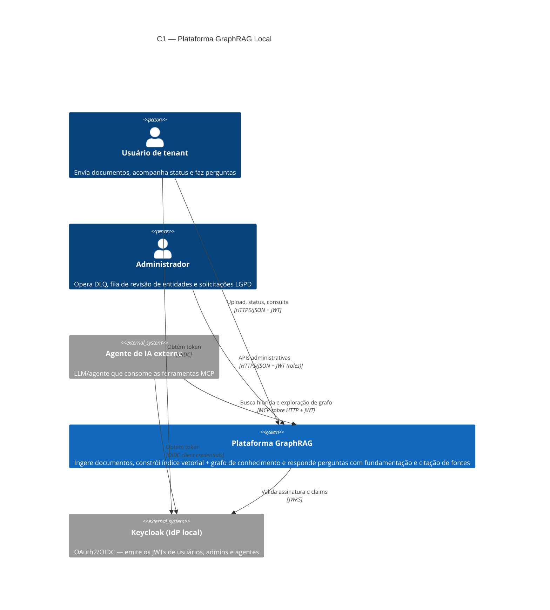
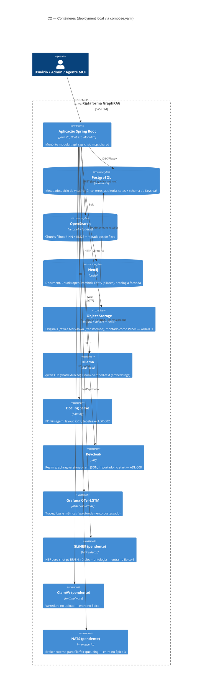
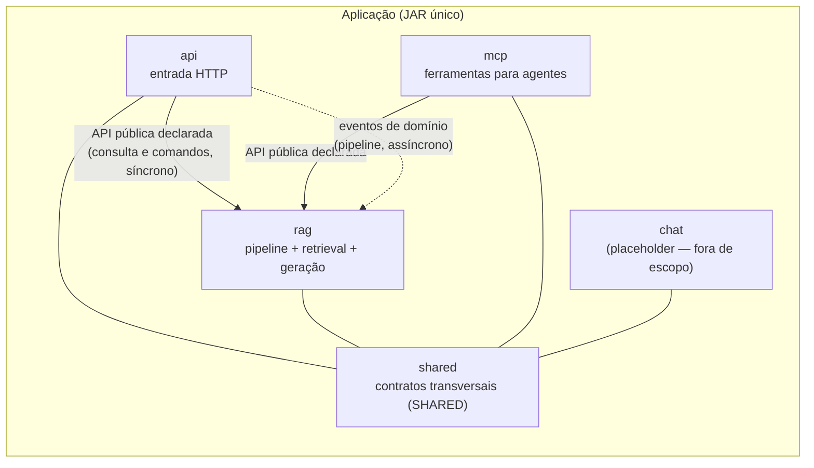
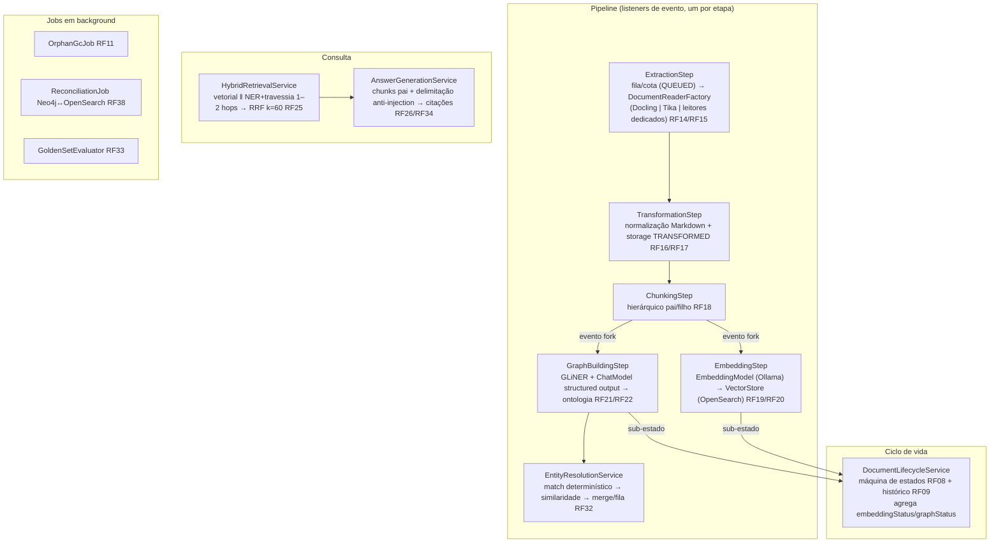
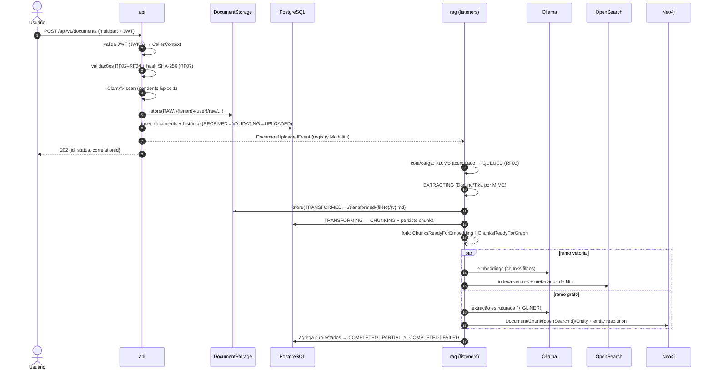
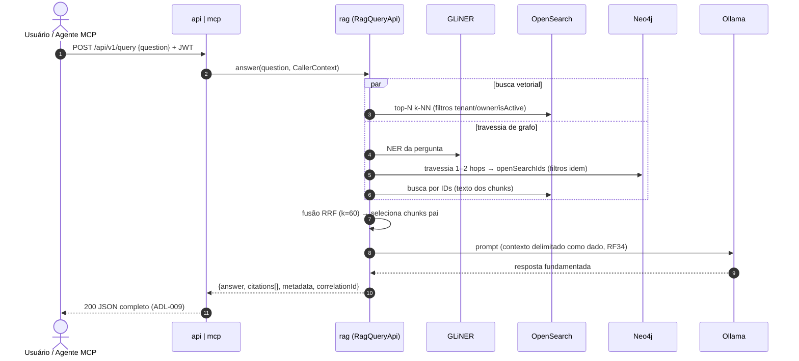

# Arquitetura — C4, Módulos e Fluxos

> Parte do [SDD](../sdd.md). Cobre: princípios de design, C4 (C1 contexto, C2 contêineres, C3 componentes por módulo), fluxos de runtime, tratamento de erros/logging e pontos de extensão. Modelos de dados detalhados em `dados.md`; segurança em `seguranca.md`.

---

## 1. Princípios de design

1. **Monólito modular (Spring Modulith).** Um JAR, cinco módulos (`api`, `rag`, `chat`, `mcp`, `shared`) com fronteiras verificadas em build (`ModularityTest` / `ApplicationModules.verify()`). O sistema simula uma arquitetura distribuída — eventos, filas, resiliência — sem pagar o custo operacional de microserviços.
2. **Pipeline orientado a eventos.** A ingestão é uma cadeia assíncrona de etapas (RF08); cada etapa consome um evento, faz uma coisa, persiste o resultado e publica o próximo evento. Nenhuma etapa chama a seguinte diretamente.
3. **Toda dependência externa atrás de uma porta.** Storage (`DocumentStorage`, ADR-001), antimalware, NER, parsing — interfaces do domínio com adaptadores para o serviço real. Onde o Spring AI já fornece a abstração (`ChatModel`, `EmbeddingModel`, `VectorStore`), ela **é** a porta — não criamos wrapper sobre wrapper.
4. **Multitenancy estrutural.** `tenantId`/`ownerId`/`isActive` fazem parte do modelo em todas as bases e de **todo** filtro de leitura — nunca são um `WHERE` opcional (RF30). A identidade chega por JWT (Keycloak) desde o dia 1 (ADL-008).
5. **Sem estado fora das bases.** A aplicação é stateless (consulta stateless por decisão — ADL-007); todo estado vive em Postgres/Neo4j/OpenSearch/Object Storage. Reiniciar a app no meio do pipeline não perde trabalho: o *event publication registry* do Modulith reentrega eventos incompletos.
6. **Design validado por BDD.** Cada componente descrito aqui existe para satisfazer cenários `@RFxx` — quando o desenho e o cenário divergirem, o cenário (derivado do requisito) vence.

---

## 2. C1 — Contexto do sistema

Três chamadores, um sistema. O agente MCP é um chamador de primeira classe (RF25): as mesmas garantias de isolamento multitenant valem para ele. O Keycloak é externo ao *sistema* mas interno ao *deployment* — roda no mesmo `compose.yaml`.

---

## 3. C2 — Contêineres

| Contêiner | Papel no design | Status |
|---|---|---|
| Aplicação Spring Boot | Único deployable; roda no host em dev (`spring-boot:run`/`test-run`) ou como imagem (`spring-boot:build-image`) | ✅ esqueleto |
| PostgreSQL | Fonte da verdade do ciclo de vida e de tudo que precisa de transação; também hospeda o schema do Keycloak (padrão de referência ADL-008) | ✅ container |
| OpenSearch | Índice dos **chunks filhos** (RF18): k-NN + BM25 na mesma engine | ✅ container |
| Neo4j | Grafo de conhecimento; ponte com o vetorial via `openSearchId` obrigatório (RF23) | ✅ container |
| Object Storage | MinIO atrás do JuiceFS: a app enxerga filesystem POSIX, o "bucket" é simulado com fidelidade (ADR-001) | ✅ containers (fricção de credenciais — [0.5]) |
| Ollama | Chat + embeddings residentes juntos (`OLLAMA_MAX_LOADED_MODELS=2`, ADR-003) | ✅ container |
| Docling Serve | Parsing pesado fora da JVM (ADR-002) | ✅ container |
| Keycloak | Última versão; build otimizado + realm JSON versionado; healthcheck no management port | ⏳ entra no Épico 0/1 (ADL-008) |
| GLiNER | Sidecar CPU de NER; contrato HTTP `texto + rótulos → entidades tipadas` | ⏳ Épico 6, spike + ADR (ADL-006) |
| ClamAV | `clamd` acessado no upload, antes de `UPLOADED` | ⏳ Épico 1 ([1.3]) |
| NATS | Substitui os eventos internos onde fila real/fair queueing forem necessários | ⏳ Épico 3 ([3.4]) |
| LGTM | Recebe OTLP; dashboards postergados | ✅ container (conflito de porta 3000 com a app — [0.3]) |

---

## 4. C3 — Componentes por módulo

### 4.1 Mapa de módulos e regras de dependência

Regras (verificadas por `ModularityTest`):

- `shared` é `ApplicationModule.Type.SHARED` — visível a todos.
- `api → rag` e `mcp → rag` são as **únicas** dependências diretas entre módulos, declaradas em `allowedDependencies`, e apenas para as interfaces públicas na raiz de `rag`. Justificativa: consulta e comandos (exclusão, reprocessamento) são síncronos por natureza — evento não serve para requisição/resposta.
- O **pipeline** é 100% por eventos: `api` publica, `rag` consome. `rag` não conhece `api`.
- Subpacotes `internal/` são invisíveis fora do módulo. Tudo que não precisa ser público é `internal`.
- `chat` permanece vazio (`package-info.java`), documentado como fora de escopo (ADL-007) — os pontos de extensão estão em `consulta.md`.

### 4.2 Módulo `api` — entrada HTTP

| Componente (indicativo) | Responsabilidade | RFs |
|---|---|---|
| `DocumentController` | `POST /api/v1/documents` (202 + id/status/`correlationId`), `GET /{id}/status`, `GET /{id}/history`, `DELETE /{id}` (soft delete), `POST /{id}/reprocess`, `POST /{id}/versions` | RF01, RF09, RF10 |
| `QueryController` | `POST /api/v1/query` — resposta síncrona completa (ADL-009) | RF25, RF26 |
| `internal/UploadValidationChain` | Validações em cadeia: tamanho (5MB), extensão × MIME real (Tika), nome/path traversal, vazio/corrompido, duplicidade por hash, malware (porta `MalwareScanner` → ClamAV). Cada validador rejeita com erro específico | RF02–RF04, RF07 |
| `internal/UploadService` | Orquestra o caminho síncrono: validação → hash → `DocumentStorage.store(RAW,...)` → linha em `documents` → transições `RECEIVED→VALIDATING→UPLOADED` → publica `DocumentUploadedEvent` | RF05–RF07 |
| `internal/AdminController` | Superfície administrativa (roles de admin): DLQ/reprocessamento, fila de revisão de entidades, solicitações LGPD | RF29, RF32, RF36 |
| `internal/ApiExceptionHandler` | `@RestControllerAdvice`: captura `HttpApplicationError` → `ProblemDetail` (RFC 9457) | RF02 |
| `CallerContext` (em `shared`) + resolver | Argument resolver que materializa `{tenantId, ownerId, roles}` das claims do JWT — controllers nunca leem token cru | RF30 |

### 4.3 Módulo `rag` — pipeline, retrieval e geração

O coração do sistema. Interfaces públicas na raiz (consumidas por `api`/`mcp`); todo o resto em `internal/`.

**API pública (raiz do módulo):**

| Interface (indicativa) | Operações | Consumidor |
|---|---|---|
| `RagQueryApi` | `answer(question, callerContext)` → resposta + citações; `search(question, callerContext)` → contexto híbrido bruto (para MCP) | `api`, `mcp` |
| `DocumentCommandApi` | `softDelete`, `reprocess`, `newVersion`, `lgpdErasure` — comandos síncronos sobre o ciclo de vida | `api` |

**Componentes internos, agrupados por área:**

Notas de design:

- **Um listener por etapa**, cada um: consome evento → executa → persiste → registra transição via `DocumentLifecycleService` → publica o próximo evento. Falha em qualquer etapa cai no tratamento de `resiliencia-e-operacao.md` (status `*_FAILED`, retry, DLQ) sem afetar outros documentos (RF13/RF27).
- **Fork-join:** `ChunkingStep` publica **dois** eventos; `DocumentLifecycleService` agrega os sub-estados e deriva `COMPLETED`/`PARTIALLY_COMPLETED`/`FAILED` quando os dois ramos terminam (RF08).
- **Resiliência nas bordas:** chamadas a Ollama/GLiNER/Docling envolvidas por Resilience4j (circuit breaker + timeout, RF37) — o fallback é por etapa (detalhe em `resiliencia-e-operacao.md`).
- **Retrieval híbrido** roda as duas buscas **sempre em paralelo** (RF25); filtros `tenantId`/`ownerId`/`isActive` aplicados em ambas, sem caminho de código que os omita.

### 4.4 Módulo `shared` — contratos transversais

| Item | Papel |
|---|---|
| `ApplicationError` / `HttpApplicationError` | Hierarquia de erros; HTTP-facing sabe se renderizar como `ProblemDetail` |
| `Logger` / `LoggerFactory` / `internal/Slf4JLogger` | Logging centralizado, cache por classe — nunca `LoggerFactory.getLogger` do SLF4J direto |
| Eventos de domínio | `DocumentUploadedEvent`, `DocumentExtractedEvent`, `DocumentTransformedEvent`, `DocumentChunkedEvent`, `EmbeddingCompletedEvent`, `GraphBuildingCompletedEvent`, `Document*FailedEvent` — records imutáveis, todos carregam `documentId`, `tenantId`, `ownerId`, `correlationId` (contratos exatos em `dados.md`) |
| `DocumentStorage` (porta, ADR-001) | `store/retrieve/delete(stage, key)` com stages `RAW`/`TRANSFORMED`; usada por `api` (raw) e `rag` (transformed) — por isso vive em `shared` |
| `CallerContext` | Record `{tenantId, ownerId, roles}` — a identidade que atravessa módulos |

### 4.5 Módulo `mcp` — ferramentas para agentes

Expõe via `spring-ai-starter-mcp-server-webmvc` ferramentas que delegam para `RagQueryApi`: busca híbrida (contexto unificado topologia + texto) e exploração de entidade/vizinhança. Autenticação JWT idêntica à REST (client credentials para agentes — `seguranca.md`); o `CallerContext` do agente restringe tudo ao tenant dele. Nenhuma lógica de retrieval própria — o módulo é um adaptador de protocolo.

### 4.6 Módulo `chat` — placeholder

Vazio por decisão (ADL-007). A dependência `spring-ai-starter-model-chat-memory-repository-neo4j` sai do `pom.xml` até existir RF de conversação. Pontos de extensão descritos em `consulta.md` §extensões.

---

## 5. Fluxos de runtime

### 5.1 Ingestão (síncrono + assíncrono)

### 5.2 Consulta (síncrono, stateless)

Se o circuito do Ollama estiver aberto (RF37): a consulta **degrada** — retorna os trechos recuperados sem geração, com indicação explícita, em vez de travar (detalhe em `resiliencia-e-operacao.md`).

---

## 6. Tratamento de erros e logging (amarração das convenções)

- **Erros de negócio** estendem `ApplicationError`; os que cruzam HTTP estendem `HttpApplicationError` e carregam `HttpStatus` + `toProblemDetail()`. Um `@RestControllerAdvice` por módulo com HTTP — nunca por endpoint.
- **Erros de pipeline** não viram exceção HTTP: viram status `*_FAILED` + linha em `processing_errors` (etapa, código, tentativa, diagnóstico JSONB, `correlationId` — RF28) + evento de falha. O chamador assíncrono não existe — o "retorno" é o estado consultável (RF09).
- **Logging** via `Logger` do `shared`; toda linha de log de pipeline inclui `documentId` e `correlationId`. O `correlationId` nasce no upload, viaja em todos os eventos e é correlacionado com o trace OTel existente.

---

## 7. Pontos de extensão (desenhados, não implementados)

| Extensão | Costura prevista | Gatilho para ativar |
|---|---|---|
| **SSE/streaming** (ADL-009) | `AnswerGenerationService` já separa *retrieval* de *geração*; um endpoint SSE novo consome o mesmo pipeline com `ChatModel.stream(...)`, emitindo evento terminal com citações | Existir um consumidor visual (UI) |
| **Conversação multi-turno** (ADL-007) | Contrato de sessão (`sessionId` opcional no request), camada de contexto conversacional entre `QueryController` e `RagQueryApi` (carrega histórico), reescrita de consulta (condensar histórico + pergunta antes do retrieval) — o retrieval e a geração atuais não mudam | RF novo de chat em `openspec/requirements/` |
| **NATS** (ADL-004) | Listeners de etapa consomem eventos Modulith hoje; a transição troca o transporte (binder/cliente NATS) mantendo os mesmos contratos de evento de `dados.md`; fair queueing por partição de tenant (RF39) | Épico 3 ([3.4]) |
| **Troca do modelo de embedding** (ADL-003) | `EmbeddingModel` é a porta; dimensão do índice OpenSearch parametrizada — troca exige reindexação completa (processo em `resiliencia-e-operacao.md`) | Golden set reprovar `nomic-embed-text` em pt-BR ([5.4]) |
| **Fallback do GLiNER** (ADL-006) | `NerClient` é porta; implementação alternativa delega ao `ChatModel` com structured output | Spike do GLiNER falhar |

---

## 8. Referências cruzadas

- Ciclo de vida, upload, eventos e fila: `ingestao.md` · Extração, chunking e embeddings: `extracao-e-vetorial.md` · Ontologia e grafo: `knowledge-graph.md` · Retrieval e geração: `consulta.md`
- Schemas e contratos de evento: `dados.md` · JWT/Keycloak, AuthZ e LGPD: `seguranca.md` · Falhas, DLQ, reconciliação e operação: `resiliencia-e-operacao.md` · BDD e avaliação: `qualidade-e-testes.md`
- Decisões: [ADL no índice](../sdd.md#4-architecture-decision-log-adl) · ADRs em [`../adr/`](../adr/)
