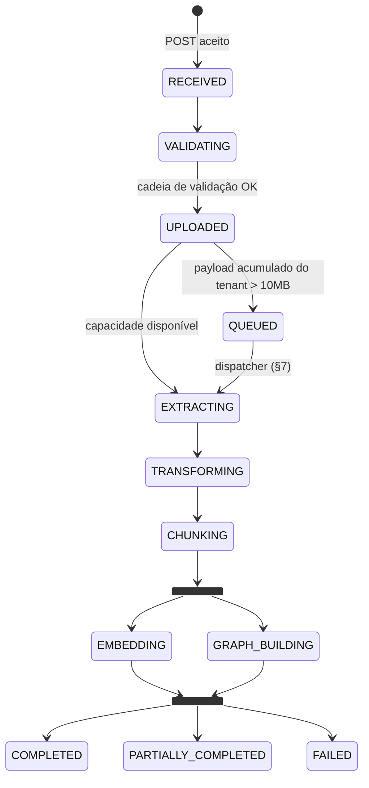

# Ingestão, Ciclo de Vida e Eventos

> Parte do [SDD](../sdd.md). Cobre o caminho do documento do `POST` até o estado terminal: upload e validações (RF01–RF07), ciclo de vida e histórico (RF08–RF10), eventos, fila e controle de carga (RF03, RF12, RF13, RF39).
> **Fora daqui:** mecânica do GC de órfãos (RF11) e efeitos do soft delete no grafo → `knowledge-graph.md`; retry/DLQ → `resiliencia-e-operacao.md`; schemas completos → `dados.md`.
> **Features BDD:** `ingestao/upload.feature`, `ingestao/validacao.feature`, `ciclo-de-vida/status-e-historico.feature`, `ciclo-de-vida/soft-delete-e-versionamento.feature`, `processamento/eventos-e-fila.feature`.

---

## 1. Contratos REST

Todos os endpoints exigem JWT (ver `seguranca.md`); `tenantId`/`ownerId` saem **sempre** do `CallerContext` — nunca do corpo da requisição.

| Endpoint | Sucesso | Erros principais |
|---|---|---|
| `POST /api/v1/documents` (multipart: `file`) | `202 Accepted` | ver tabela de validações (§2) |
| `GET /api/v1/documents` (`?page,size,sort,includeInactive`) | `200` (página compartilhada no tenant, RF40 — não restrita ao dono; `includeInactive=false` por padrão) | — |
| `GET /api/v1/documents/{id}/status` | `200` (leitura compartilhada no tenant, RF09 revisado — não restrita ao dono) | `404` (inexistente, de outro tenant, ou já excluído logicamente — mesma resposta, sem vazar existência) |
| `GET /api/v1/documents/{id}/history` | `200` (idem; sobrevive à exclusão lógica — inclui o próprio evento de exclusão, RF31) | `404` (inexistente ou de outro tenant) |
| `DELETE /api/v1/documents/{id}` | `202` (soft delete assíncrono nas 3 bases) | `404` idem |
| `POST /api/v1/documents/{id}/reprocess` | `202` (retoma da última etapa concluída) | `404`, `409` (documento em processamento) |
| `POST /api/v1/documents/{id}/versions` (multipart) | `202` (nova versão; anterior → soft delete) | validações do upload + `404` |

**Resposta do `202` de upload:**

```json
{
  "id": "5f1c...",
  "status": "UPLOADED",
  "correlationId": "b7e2...",
  "version": 1
}
```

**Resposta de status** (RF09) — expõe os sub-estados do fork-join, eliminando a ambiguidade do status agregado:

```json
{
  "id": "5f1c...",
  "status": "GRAPH_BUILDING",
  "embeddingStatus": "SUCCEEDED",
  "graphStatus": "RUNNING",
  "version": 1,
  "isActive": true,
  "uploadedAt": "...",
  "correlationId": "b7e2..."
}
```

Erros seguem RFC 9457 (`ProblemDetail`) via `HttpApplicationError` — cada rejeição carrega um `code` estável (usado pelos cenários BDD) e o motivo humano.

## 2. Cadeia de validação (RF02–RF04, RF07)

Ordem: do mais barato ao mais caro; a primeira falha interrompe e responde. Nada é gravado em storage nem em `documents` antes de a cadeia inteira passar.

| # | Validador | Regra | `code` | HTTP |
|---|---|---|---|---|
| 1 | Tamanho | `> 5MB` rejeita (RF03) | `FILE_TOO_LARGE` | 413 |
| 2 | Nome | vazio, > 255 chars, path traversal (`..`, separadores), caracteres de controle | `INVALID_FILENAME` | 400 |
| 3 | Vazio | 0 bytes | `EMPTY_FILE` | 400 |
| 4 | Extensão × MIME real | MIME detectado por **conteúdo** (Tika), não por extensão; ambos devem estar na lista do RF04 (PDF, JPG, JPEG, PNG, CSV, JSON, XML, TXT, MD) e ser coerentes entre si | `UNSUPPORTED_FILE_TYPE` / `MIME_MISMATCH` | 415 |
| 5 | Integridade estrutural | check barato por formato, **após** o tipo (conteúdo de outro formato é problema de tipo, não corrupção): PDF exige `%PDF` + trailer `%%EOF`; JPEG exige SOI/EOI; PNG exige assinatura + `IEND` (decisão D3 do change epico-1) | `CORRUPTED_FILE` | 400 |
| 6 | Duplicidade | SHA-256 já existente para o **mesmo tenant+owner** com sucesso anterior (RF07) | `DUPLICATE_FILE` | 409 |
| 7 | Cota | cota do tenant excedida (storage total ou nº de arquivos ativos — RF03 complemento); **sem linha em `tenant_quotas` = sem limite** (cota opt-in, decisão D4 do change epico-1) | `QUOTA_EXCEEDED` | 422 |
| 8 | Malware | varredura via porta `MalwareScanner` — última, por ser a mais cara; só arquivos que passaram em tudo são escaneados. **ClamAV adiado** (decisão D1 do change epico-1): o adaptador atual é um mock determinístico que detecta apenas a assinatura EICAR; a integração `clamd` real ([1.3]) troca só o adaptador | `MALWARE_DETECTED` | 422 |

Notas de design:

- **Rejeição não cria linha em `documents`.** Os estados `RECEIVED`/`VALIDATING` existem *dentro* da requisição síncrona; só o upload aceito persiste (com as transições `RECEIVED → VALIDATING → UPLOADED` gravadas no histórico de uma vez). Tentativas rejeitadas — em especial `MALWARE_DETECTED` e `DUPLICATE_FILE` — vão para log estruturado sempre, e para o log de auditoria quando o RF31 chegar. Alternativa descartada: persistir linhas `REJECTED` — poluiria `documents` com lixo de tentativa e criaria um estado fora do RF08.
- **Limite multipart do container ≠ limite de negócio.** `max-file-size` do Spring fica um pouco acima de 5MB (ex.: 6MB) para que a validação nº 1 seja quem responde, com o `ProblemDetail` de domínio — e não uma exceção genérica do container ([0.5]).
- **Corrupção profunda não é validável no upload.** A validação de integridade do RF02 cobre o detectável barato (vazio, MIME incoerente e o check estrutural nº 5 — assinatura/trailer do formato); um PDF malformado que passe nisso tudo falha em `EXTRACTING` → `EXTRACTION_FAILED` (RF27), responsabilidade da etapa de extração.
- `MALWARE_DETECTED` **não consome cota de reprocessamento** (RF02 complemento) — não há linha, não há contagem.

## 3. Idempotência por hash (RF07)

- SHA-256 calculado em streaming durante o upload (uma passada: hash + gravação em arquivo temporário).
- Chave de unicidade: `(tenant_id, owner_id, file_hash_sha256, version)` — o **mesmo arquivo enviado por outro usuário não bloqueia** (cada dono tem sua cópia lógica).
- Duplicata = mesmo hash com documento anterior em status de **sucesso** (`COMPLETED`/`PARTIALLY_COMPLETED`) ou **em processamento**. Documento anterior `FAILED` não bloqueia reenvio.
- Exceção: `POST /{id}/reprocess` (comando explícito) reexecuta sem passar pela checagem de duplicidade.

## 4. Storage do original (RF05, ADR-001)

- Chave: `/{tenantId}/{userId}/raw/{fileId}/{filename}` via `DocumentStorage.store(RAW, ...)`.
- O Postgres guarda a **chave retornada** (`raw_storage_key`), nunca caminho de filesystem cru — a implementação (JuiceFS hoje, S3 real amanhã) é detalhe do adaptador.
- Ordem de persistência no upload: storage **antes** da linha em `documents`. Se a linha falhar, o arquivo órfão no storage é inofensivo (varrido por limpeza futura); o inverso — linha sem arquivo — quebraria o pipeline.

## 5. Metadados e cotas (RF03, RF06)

- Linha em `documents` com todos os campos do RF06 (schema completo em `dados.md`): identificador, `owner_id`, `tenant_id`, nome original, extensão, tamanho, hash, data de envio, chave no storage, versão e status.
- **Cotas por tenant** (RF03 complemento): tabela `tenant_quotas` (`max_storage_bytes`, `max_active_files`) consultada na validação nº 6; uso corrente derivado por soma dos documentos `is_active = true` do tenant (sem contador materializado até que a medição justifique).
- **Semântica do "payload acumulado > 10MB"** (decisão desta seção): soma de `file_size_bytes` dos documentos do tenant em **estados não-terminais** (nem `COMPLETED`, nem `PARTIALLY_COMPLETED`, nem `FAILED`) no momento do aceite do upload. Excedeu → o documento entra `QUEUED` em vez de seguir direto para `EXTRACTING` (§7). Alternativas descartadas: medir só o payload da requisição (ignora a carga concorrente, que é o que causa OOM) e janela deslizante de bytes/min (mais precisa, complexidade sem requisito).

## 6. Ciclo de vida (RF08) e histórico (RF09)

### 6.1 Máquina de estados



- Toda transição é responsabilidade do `DocumentLifecycleService` (módulo `rag`) — etapas não fazem `UPDATE` direto de status. Transições inválidas (ex.: `CHUNKING → UPLOADED`) lançam erro: a máquina é o guardião.
- Falhas por etapa (`EXTRACTION_FAILED`, `TRANSFORMATION_FAILED`, `CHUNKING_FAILED`, `EMBEDDING_FAILED`, `GRAPH_BUILDING_FAILED` — RF27) são status válidos: o documento fica neles enquanto aguarda retry; retries esgotados → `FAILED` + DLQ (detalhe em `resiliencia-e-operacao.md`). O reprocessamento manual (RF07/RF29) retoma **da etapa falhada**, aproveitando artefatos das etapas anteriores.

### 6.2 Fork-join: sub-estados e derivação do status geral

Sub-estados `embeddingStatus` e `graphStatus`: `PENDING → RUNNING → (RETRYING) → SUCCEEDED | FAILED`.

Derivação do `status` geral após `CHUNKING` (função pura, testável isoladamente):

| `embeddingStatus` | `graphStatus` | `status` geral |
|---|---|---|
| ativo (`PENDING/RUNNING/RETRYING`) | qualquer | `EMBEDDING` |
| `SUCCEEDED`/`FAILED` | ativo | `GRAPH_BUILDING` |
| `SUCCEEDED` | `SUCCEEDED` | `COMPLETED` |
| `SUCCEEDED` | `FAILED` | `PARTIALLY_COMPLETED` |
| `FAILED` | `SUCCEEDED` | `PARTIALLY_COMPLETED` |
| `FAILED` | `FAILED` | `FAILED` |

Enquanto os dois ramos rodam, o status geral mostra `EMBEDDING` por convenção determinística — a API de status expõe os dois sub-estados (§1), então nenhum cliente precisa adivinhar. `PARTIALLY_COMPLETED` é estado **terminal e útil**: os chunks com embedding ficam disponíveis para consulta (RF25), e a falha do outro ramo fica registrada para reprocessamento manual.

### 6.3 Histórico (RF09)

- Cada transição gera uma linha em `document_status_history` (`from_status`, `to_status`, `branch` opcional — `EMBEDDING`/`GRAPH_BUILDING` para transições de sub-estado —, `occurred_at`, `detail`).
- `GET /{id}/history` devolve a lista ordenada. Documento inexistente ou de outro tenant/dono: `404` uniforme.

### 6.4 Soft delete e versionamento (RF10)

- `DELETE /{id}` → `DocumentCommandApi.softDelete`: marca `is_active = false` na linha relacional, inativa vetores no OpenSearch (update de metadado `isActive`) e marca `Document`/`Chunks` no Neo4j — entidades compartilhadas ficam intactas (mecânica de grafo em `knowledge-graph.md`). A operação é assíncrona (`202`) e idempotente.
- **Nova versão** = **nova linha** em `documents` com `version = anterior + 1` (a chave única `(tenant, owner, hash, version)` permite conteúdo idêntico em versões distintas). A nova versão percorre o pipeline completo (RF10 complemento — sem diffing incremental); ao concluir com sucesso, a anterior segue o fluxo de soft delete. Enquanto a nova processa, a anterior continua ativa — a consulta nunca fica sem resposta durante substituição.

## 7. Eventos, fila e controle de carga (RF12, RF13, RF39)

### 7.1 Eventos internos (fase atual — Spring Modulith)

- Publicação via `ApplicationEventPublisher` na mesma transação da mudança de estado, com o **event publication registry** (persistido no Postgres — `spring-modulith-starter-jpa`): entrega *at-least-once*, reemissão automática de publicações incompletas no restart. É isso que torna seguro reiniciar a app no meio do pipeline.
- Catálogo de eventos e payloads em `dados.md`. Todos carregam `documentId`, `tenantId`, `ownerId`, `version`, `correlationId`.
- Listeners são `@ApplicationModuleListener` (assíncronos, transação própria).

### 7.2 Consumo idempotente (RF13)

Regra dupla — guarda + efeito idempotente:

1. **Guarda de estado:** todo listener carrega o documento e confere se o status atual é o esperado para a etapa; evento reentregue para documento que já avançou é reconhecido e ignorado (log, sem erro).
2. **Efeitos idempotentes por construção:** extração/transformação sobrescrevem o artefato da mesma versão; chunking apaga e recria os chunks da versão; indexação vetorial usa `chunkId` determinístico (upsert); escrita no grafo usa `MERGE` por chave natural. Processar duas vezes produz o mesmo resultado.

Falha no processamento de um documento não afeta os demais: cada evento/documento tem transação e retry próprios (RF13); o isolamento é por construção — não há lote.

### 7.3 Fila `QUEUED` e fair queueing (pré-NATS)

Antes do broker externo, a "fila" é o próprio Postgres + um dispatcher agendado:

- Upload que excede o teto de 10MB acumulado (§5) entra `QUEUED` — **nenhum evento de extração é publicado ainda**.
- Um dispatcher (`@Scheduled`) varre documentos `QUEUED` ordenados por `uploaded_at` e libera para `EXTRACTING` respeitando dois limites configuráveis: **global** (`app.pipeline.max-concurrent-extractions`) e **por tenant** (`app.pipeline.max-concurrent-extractions-per-tenant`) — este último é a mitigação imediata do *noisy neighbor* (RF39): um tenant com 200 documentos na fila não impede o vizinho com 2 de ser atendido.
- Seleção entre tenants: round-robin entre tenants com documentos `QUEUED`, não FIFO global — FIFO global reintroduziria o monopólio que o RF39 proíbe.
- Esses limites de concorrência são também o instrumento do **RNF02** (throughput de ingestão sem degradar a consulta em andamento): o teto global protege a CPU/heap que a consulta compartilha; a meta numérica fica para o Épico 10, o botão de controle já existe aqui.

### 7.4 Transição para NATS (Épico 3, ADL-004)

Os contratos de evento não mudam — muda o transporte: JetStream com *stream* por etapa do pipeline, particionamento por `tenantId` e limite de entrega por consumidor (fair queueing pleno do RF39); DLQ nativa via *max deliveries* (amarração em `resiliencia-e-operacao.md`). O dispatcher do §7.3 se dissolve no controle de consumo do broker. Spike + ADR próprio antes da migração ([3.4]).

---

## 8. Decisões registradas nesta seção

| Decisão | Alternativa descartada | Motivo |
|---|---|---|
| Rejeição de upload não persiste em `documents` | linha com status `REJECTED` | estado fora do RF08; lixo de tentativa na tabela principal; auditoria cobre o rastro |
| 10MB = soma dos tamanhos em estados não-terminais do tenant | payload da requisição isolado; janela deslizante | é a carga *concorrente* que causa OOM; janela é complexidade sem requisito |
| Status geral no fork = `EMBEDDING` (determinístico) + sub-estados na API | estado novo `PROCESSING` | não inventar estado fora do RF08; API expõe a verdade completa |
| Multipart limit ligeiramente acima de 5MB | igualar a 5MB | garantir que o erro seja o de domínio (413 + `code`), não o genérico do container |
| Nova versão = nova linha (`version + 1`); anterior ativa até a nova concluir | mutar a linha existente | histórico íntegro, rollback trivial, consulta sem janela morta |
| Fila pré-NATS = Postgres + dispatcher round-robin por tenant | broker externo desde já | eventos Modulith seguram o escopo atual; NATS entra quando RF39 exigir partição real ([3.4]) |
