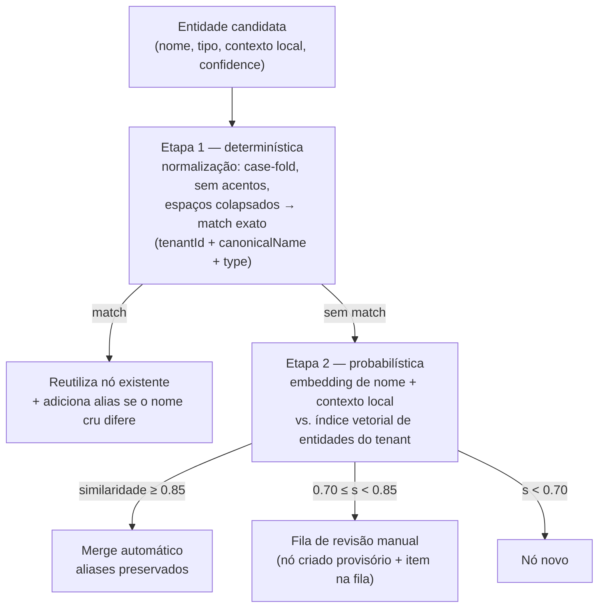

# Knowledge Graph — Ontologia, Extração, Entity Resolution e GC

> Parte do [SDD](../sdd.md). Cobre o ramo `GRAPH_BUILDING` (RF21–RF24), a resolução de entidades (RF32), os efeitos de soft delete no grafo (RF10) e o garbage collection de órfãos (RF11).
> **Features BDD:** `knowledge-graph/extracao-entidades.feature`, `knowledge-graph/construcao-grafo.feature`, `knowledge-graph/entity-resolution.feature`, `ciclo-de-vida/garbage-collection.feature`.

---

## 1. Ontologia fechada e versionada (RF21)

- **Entidades:** `PERSON`, `ORGANIZATION`, `PRODUCT`, `TECHNOLOGY`, `LOCATION`, `DATE`, `CONCEPT`.
- **Relacionamentos:** `USES`, `DEPENDS_ON`, `PART_OF`, `AUTHORED_BY`, `MENTIONS` + escape `RELATED_TO {description}` para o que não encaixa — o escape **absorve** em vez de rejeitar, mas sua taxa de uso é métrica de qualidade: se a maioria das relações extraídas cair em `RELATED_TO`, a ontologia está frouxa para o corpus e deve ser revisada (corpus é genérico por decisão da descoberta).
- A ontologia vive em **configuração versionada no repositório** (constante/`ontology.yaml`), com `schemaVersion` (inteiro). Todo nó `Entity` grava o `schemaVersion` vigente na extração.
- **Mudança de ontologia** = nova versão + estratégia de migração declarada junto: (a) mapeável (renomear/fundir tipos) → migração Cypher em lote; (b) não mapeável (tipo novo que exige reinterpretar texto) → marcar entidades da versão anterior e reprocessar o ramo `GRAPH_BUILDING` dos documentos afetados. Sem migração declarada, a mudança não entra.

## 2. Extração híbrida (RF21)

Duas passadas por chunk (filho), no listener de `ChunksReadyForGraphBuildingEvent`:

1. **GLiNER (sidecar, ADL-006):** NER zero-shot com os rótulos da ontologia — contrato HTTP `{text, labels[]} → [{span, label, score}]`. Rápido, cobre entidades "triviais" e alimenta a passada seguinte com candidatos.
2. **LLM (qwen3:8b via `ChatModel`):** recebe o chunk + candidatos do GLiNER e extrai **relacionamentos** e entidades que exigem interpretação, com **structured output** (schema JSON derivado da ontologia — Spring AI structured output / tool calling). Temperatura 0.

**Validação da saída (RF21 + RF34):** a resposta da LLM é validada contra o schema fechado — tipo de entidade ou relação fora da ontologia é **descartado sem interromper o pipeline** (log + contador). Isso é simultaneamente controle de qualidade e mitigação de injeção de entidades falsas (`seguranca.md` §4).

- Entidades carregam `confidence` (score do GLiNER; extrações só-LLM recebem valor fixo conservador) — insumo para a fila de revisão do ER.
- Falha do GLiNER (circuito aberto) degrada para extração só-LLM (fallback da ADL-006); falha da LLM segue o fluxo de retry/circuit breaker padrão (`resiliencia-e-operacao.md`).

## 3. Construção do grafo (RF22, RF23)

Escrita no Neo4j por transação de documento (schema completo em `dados.md`):

- `MERGE` de `(:Document {id})`, `(:Chunk {id})` com `CHILD_OF` refletindo a hierarquia do chunking, `(:Chunk)-[:MENTIONS]->(:Entity)` e as relações `Entity↔Entity` da ontologia.
- **`openSearchId` é obrigatório e igual ao `chunkId`** (mesmo valor, determinístico — decisão de `extracao-e-vetorial.md` §4.1): a escrita de um `Chunk` sem `openSearchId` é rejeitada na camada de aplicação **e** por constraint de existência no banco (RF23). A propriedade mantém o nome do requisito, ainda que o valor coincida com o id — é a ponte vetor↔grafo do retrieval (RF25) e da reconciliação (RF38).
- **Todo nó carrega `tenantId`** e toda query (leitura e escrita) é ancorada nele — o isolamento é do modelo (RF24/RF30), não da disciplina de lembrar um `WHERE`.

## 4. Entity resolution (RF32)

Executado **antes** de persistir cada `Entity` candidata, sempre dentro do tenant:

- **Embedding de entidade (default técnico):** `nomic-embed-text` sobre `"{nome} — {sentença do contexto}"`, armazenado como propriedade `nameEmbedding` do nó `Entity` com **índice vetorial nativo do Neo4j** (cosseno, 768d, filtrado por `tenantId`+`type`). Alternativa descartada: índice separado no OpenSearch — segunda base para consistir com o grafo, mais um alvo de reconciliação, sem ganho no volume local.
- **Fila de revisão:** faixa intermediária cria o nó **provisório** (o pipeline não bloqueia — RF32) + item em `entity_review_queue` (Postgres) com os dois candidatos e a similaridade. Admin decide via API (`api` módulo, role própria): *merge* (consolida aliases, religa `MENTIONS`, remove provisório) ou *keep* (marca como distinto — pares marcados não voltam à fila).
- **Limiares configuráveis** (`app.graph.er.auto-merge-threshold` = 0.85, `review-threshold` = 0.70 — ADL-005: pontos de partida, calibrados pelo golden set).
- **Nunca cross-tenant:** todas as etapas filtram por `tenantId`; não existe caminho de código que compare entidades de tenants diferentes.

## 5. Escopo global × local (RF24)

- Consultas "globais" (insights do tenant inteiro) são ancoradas por `tenantId`; consultas restritas validam também `ownerId` nos `Document`s de origem dos chunks atravessados.
- Detecção de comunidades (Leiden/Louvain via Neo4j GDS) fica **fora do escopo atual** — o modelo já suporta o agrupamento exigido pelo RF24 (âncora de tenant + topologia de entidades); o algoritmo entra como melhoria futura se um RF o pedir. Registrado para não virar escopo fantasma.

## 6. Soft delete no grafo (RF10) e GC de órfãos (RF11)

- **Soft delete:** `Document` e seus `Chunk`s recebem `isActive = false`; **nada é removido**. Entidades e relacionamentos ficam intactos — outros documentos ativos podem referenciá-los (cenário BDD `@SoftDelete`).
- **GC (job em background, cadência configurável — default diário):**
  1. Por tenant, localizar `Entity` sem **nenhum** `MENTIONS` vindo de `Chunk` com `isActive = true`;
  2. Hard delete físico do nó e de seus relacionamentos, em lotes (batch com limite por transação para não travar o banco);
  3. Cada remoção registrada (contadores + log com `tenantId`/entidade) — o GC é técnico e assíncrono, **distinto** do hard delete síncrono da LGPD (RF36, `seguranca.md`).
- Entidade com ao menos um chunk ativo é preservada — o job é conservador por construção (só remove o comprovadamente órfão).

## 7. Decisões registradas nesta seção

| Decisão | Alternativa descartada | Motivo |
|---|---|---|
| `openSearchId` = `chunkId` (mesmo valor, propriedade mantida) | id separado por base | elimina mapeamento, simplifica RF38; nome preservado por rastreabilidade ao RF23 |
| Embedding de entidade no índice vetorial nativo do Neo4j | índice no OpenSearch | ER fica autocontido no grafo; menos um par a reconciliar |
| Nó provisório + fila para a faixa intermediária | bloquear pipeline até revisão | RF32 não permite travar ingestão por curadoria |
| Ontologia em configuração versionada + `schemaVersion` no nó | ontologia implícita no prompt | RF21 exige versionamento e migração rastreável |
| GLiNER alimenta a LLM com candidatos (pipeline em duas passadas) | passadas independentes com merge posterior | a LLM desambigua melhor com candidatos; merge posterior duplicaria ER |
| Comunidades (GDS) fora do escopo | implementar Leiden agora | RF24 pede modelo que suporte agrupamento, não algoritmo; regra "sem RF não entra" |
